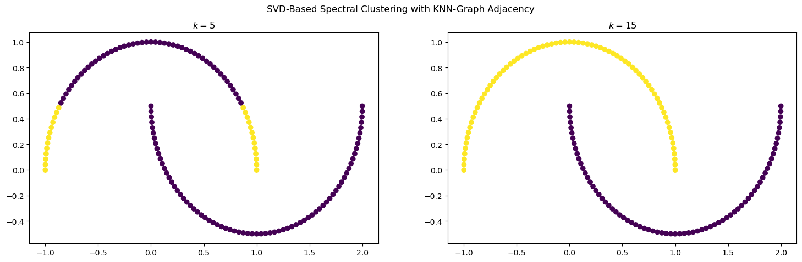
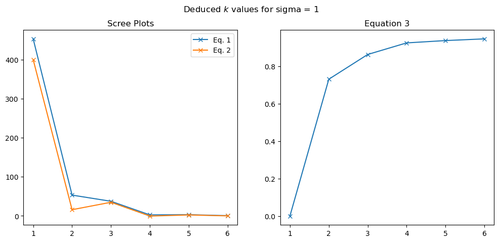

# PRESENTAZIONE PROGETTO MACHINE LEARNING

 

**DINO MENG [SM3201466]**

---

# Topics:
1. Idea of Spectral Clustering, Refreshers on SVD
2. Spectral Clustering Algorithm and its SVD-based variant
3. Experiments

---

# Spectral Clustering (Idea)

**Idea**: Group data by building a similarity graph, use clusters within the graph by optimal cuts

We will se how we can implement this

---

# SVD (Refreshers)

The *SVD* (Singular-Value Decomposition) is a popular matrix decomposition technique based on the spectral decomposition

$$
A = U\Sigma V^T
$$

Applications:
- Low-Rank Reduction of Matrixes (Eckart-Young Theorem)
- Image Compression
- Dimensionality 
- **We will see**: Clustering

---

# Spectral Clustering (Non-Normalised)

> *Source: Ulrike von Luxburg, A Tutorial on Spectral Clustering*
---

# Spectral Clustering (Remark)

> **Remark**: it can be proved that the algorithm previously described solves the optimal-cut problem of the graph $G$

---

# SVD-Based Spectral Clustering (Idea)
**IDEA.** Instead of finding the eigenvalues of the Laplacian $L = D-A$, diagonalize the matrixes $A^T A$ and $AA^T$ (thus determining a SVD of $A$)

---

# SVD-Based Spectral Clustering
Parameters: 
- Number of clusters $k$
- Amount of left-sided singular vectors to consider $l$ (usually $l=k$)

Algorithm:
1. Create the similarity matrix $A$ with a desired method
2. Determine a SVD of $A$, i.e. $A = V \Sigma U^T$
3. Take the first $l$ columns of $V$, denote it as $V'$
4. Run *K-means* on $V'$, the resulting clusters is the output

---

# Main Results: Synthetic Datasets

Three main experiments, based on synthetically generated datasets:
1. Compare the performances between Spectral Clustering and its SVD variant
2. Test the SVD-Based Clustering on non-linear datasets (with variations on the parameters)
3. Deduce the parameter $k$ from the singular values contained in $\Sigma$

---

# Synthetic Datasets

---

# Synthetic Datasets

---

# Synthetic Datasets

---

# Experiment 1
**Similarity Measure**: Gaussian Kernel $s(x,y)=\exp{(\lVert x-y\rVert_2 / (2\sigma)^2)}$ with $\sigma=1$

---

# Expriment 1 (Remarks)

- Classical Spectral Clustering produces unsatisfying clusters
- SVD-based variant produces well-separated clusters
- To fix the issue with the classical Spectral Clustering, other approaches could have been taken:
    - Use another method to construct the similarity graph (e.g. K-nearest neighbours)
    - Use the Normalized Laplacian instead

---

# Experiment 2

**Similarity Measure**: For the two circles, we used the same one in Experiment 1. For the two moons dataset, we used the K-nearest neighbours method to  construct the similarity graph

**Parameters**: For the two circles dataset, we tweaked the hyperparameter $l$ for $l=1$, $l=2$.

---

# Experiment 2 (Results)

---

# Experiment 2 (Results)

---

# Experiment 2 (Remarks)

- By changing the hyperparameters, SVD-Based Spectral Clustering is able to handle non-linearly separable datasets

- In some cases, reducing the $l$ parameter can reveal to be useful (whereas usually it is to be set $l \geq k$, usually $l=k$)

---

# Experiment 3: Deducing Parameters

- To determine the optimal value for $k$, three formulas have been employed:

$$
\begin{gather}
(1) \  \sigma_k - \sigma_{k+1} \\
(2) \ \sigma_k - 2\sigma_{k+1} + \sigma_{k+2} \\
(3)\ \frac{\sum_{i \leq k} \sigma_i}{ \sum_{i \leq N} \sigma_i}
\end{gather}
$$

- Where in (1) or (2) we can find the optimal $k$ value or use the elbow method
- In (3) we want to find the minimal $k$ such that its value is greater than a set threshold $\theta \in (0,1)$, which is to be derived through experimenting

- To verify the hyperparameter of the similarity measure (e.g. for the gaussian kernel it's $\sigma$), compare the $k$ derived from (2), (3) and verify that they're consistent

---

# Experiment 3: Analysis

---

# Experiment 3: Analysis

---

# Experiment 3: Results

Therefore we deduced the variables $k=4$ and $\sigma=1$

