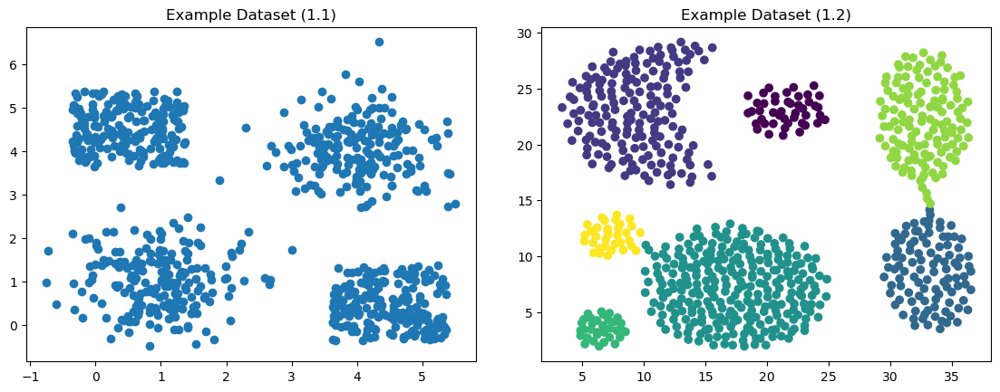
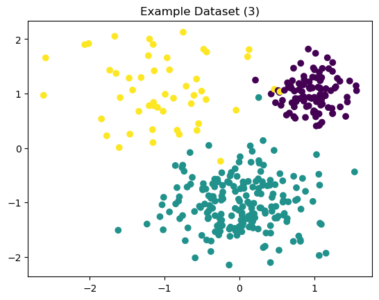

$\hrulefill$

# 1. Introduzione

In questo report si andrà a studiare due tecniche di clustering basate principalmente sulla diagonalizzazione delle *Similarity Matrix* (matrici di "somiglianza"). L'algoritmo in questione è la cosidetta *Spectral Clustering*.

In una delle tecniche si applicherà la fattorizzazione delle matrici più notevole, vale a dire la *Singular Value Decomposition* (decomposizione ai valori singolari). Il risultato principale legato alla *SVD* è il teorema di Eckart-Young, che enuncia il seguente:

> *Teorema 1 (Eckart-Young).* Sia $A \in \mathbb R^{m \times n}$ una matrice reale e sia data una sua SVD $A = V\Sigma U^T = \sum_i \sigma_i V^{(i)} V^{(i), T}$. Definita $A_k$ la SVD troncata di $A$, si ha che $A$ è di rango $k$ e che vale la seguente equazione: $$\forall B \in \mathbb R^{m \times n}\text{ s.t. }\text{rank}(B)\leq k, \lVert A-A_k \rVert_2 \leq \lVert A-B\rVert_2  $$ ovvero minimizza la distanza da $A$ in norma spettrale

La *SVD* si ritrova quindi ad essere già applicata negli altri ambiti nell'analisi dei dati, tra cui la riduzione della dimensionalità (*PCA*), compressione delle immagini e la *Low-Rank Approximation*. Si andrà a focalizzare su come sia possibile applicare questa tecnica nell'ambito del *Clustering*.

$\hrulefill$

# 2. Algoritmi di Clustering
Adesso descriveremo gli algoritmi di *Spectral Clustering*, partendo dalla sua formulazione originale. 

## 2.1. Spectral Clustering

Andremo a descrivere l'algoritmo *Spectral Clustering*. Le informazioni verranno principalmente tratte dal paper *"A Tutorial on Spectral Clustering"* (2007) di *Ulrike von Luxburg*.

**ALGORITMO.** (*Spectral Clustering Non Normalizzata*) 

Input: I dati $X \in \mathbb R^{m \times n}$ e il numero di cluster $k$ da formare

1. Costruire un grafo di somiglianza (*similarity graph*) $G = (V,E)$ a partire dai dati $X$
2. Calcolare la matrice laplaciana non normalizzata $L$ del grafo $G$
3. Calcolare i primi $k$ autovettori $u_1, \ldots, u_k$ di $L$
4. Sia $U \in \mathbb R^{n \times k}$ la matrice degli autovettori in colonna, ossia $U^{(i)} = u_i$
5. Considerare le righe della matrice $U$ e denotarli con la sequenza $(y_i)_{i = 1, \ldots, n}$
6. Effettuare il clustering sui punti $(y_i)_i$ con l'algoritmo *K-Means* e restituire i cluster formati

Osserviamo che il passo cruciale dell'algoritmo è il primo passaggio, ovvero la costruzione del grafo di somiglianza $G$, che viene rappresentata sotto forma di una matrice di adiacenze $A$.

Nel paper di riferimento vengono menzionati più metodi per costruire tale matrice. Il metodo di cui useremo più frequentemente consiste in creare un grafo connesso e pesato, dove gli archi vengono pesati da una funzione di somiglianza predefinita. Ad esempio, si userà il nucleo gaussiano $s(x, y):=\exp(-\lVert x-y \rVert^2 / (2\sigma)^2)$. 

Inoltre, è possibile trarre un'interpretazione geometrica di questo algoritmo. Dato un grafo $G=(V,E)$, il *problema dei minimi $k$-tagli* (minimum $k$-cut) consiste in cercare un insieme minimo di archi per cui la loro rimozione comporta in una partizione di $k$ componenti connesse del grafo. Nel caso di presenza degli archi pesati, si cerca di minimizzare la somma dei pesi degli archi tagliati (fig. \ref{minkcuts}).

Si dimostra che un rilassamento del *problema dei minimi $k$-tagli* si riconduce al *Spectral Clustering* appena descritto; il rilassamento è un passaggio necessario, in quanto si dimostra che il problema è NP-hard.

{ width=40% }

## 2.2. SVD-Based Spectral Clustering

In una pubblicazione recente [1] è stato proposto una variante dell'algoritmo *Spectral Clustering*, in cui si applica la decomposizione ai valori singolari (*SVD*) nell'algoritmo. L'idea principale consiste in sostituire la diagonalizzazione della matrice laplaciana $L$ con la diagonalizzazione delle matrici $A^T A$ e $AA^T$; si richiama che $A$ denota la matrice delle adiacenze del grafo $G=(V,E)$. 

Dunque l'algoritmo sarà come segue.

**ALGORITMO.** (*Spectral Clustering Basata sulla SVD*)

Input: I dati $X \in \mathbb R^{m \times n}$, il numero di cluster $k$ da formare e il numero di vettori singolari sinistri da prendere in considerazione $l$

1. Costruire un grafo di somiglianza (*similarity graph*) $G = (V,E)$ a partire dai dati $X$ e rappresentarla mediante la matrice $A \in \mathbb R^{n \times n}$
2. Determinare una decomposizione ai valori singolari (SVD) di $A = U \Sigma V^T$
3. Scegliere i primi $l$ autovettori $u_1, \ldots, u_k$ di $U$ e
4. Sia $U' \in \mathbb R^{n \times k}$ la matrice degli autovettori in colonna, ossia $U'^{(i)} = u_i$
5. Considerare le righe della matrice $U'$ e denotarli con la sequenza $(y_i)_{i = 1, \ldots, n}$
6. Effettuare il clustering sui punti $(y_i)_i$ con l'algoritmo *K-Means* e restituire i cluster formati

Si osserva che è stato scelto di imporre la scelta del numero degli autovettori da considerare come un parametro. Nella pubblicazione [1] si istruisce di scegliere $l=k$ solitamente, e di eventualmente farlo variare in caso di creazione di cluster insoddisfacenti.

[1] Z. Jia, «The reaserch on parameters of spectral clustering based on SVD», in Proceedings of 2013 3rd International Conference on Computer Science and Network Technology, Dalian, China: IEEE, ott. 2013, pp. 23–27. doi: 10.1109/ICCSNT.2013.6967056.

$\hrulefill$

# 3. Metodologia

In questa sezione svilupperemo tre esperimenti con dataset artificiali, per verificare le seguenti affermazioni:

1. L'autore di [1] sostiene che dalla scelta di diagonalizzare $AA^T$ invece della laplaciana $L$ si ottiene un processo di clustering più efficace
2. L'algoritmo *SVD-Based Clustering* è in grado di effettuare clustering su dati non linearmente separabili
3. L'autore di [1] afferma che oltre a fornire un processo robusto di clustering, la decomposizione ai valori singolari (SVD) è usufruibile anche per dedurre i parametri $k$ e $\theta$, dove $\theta$ è un parametro eventuale del metodo della costruzione del grafo di

L'implementazione degli algoritmi descritti nella *Sezione 2* sono stati implementati, per la maggior parte, con NumPy.

## 3.1. Dataset 1: Confronto tra Spectral Clustering con la sua variante SVD-Based

In questo esperimento si ha un dataset che contiene quattro cluster, di cui due sono di forma quadrata e gli altri due sono a forma di macchie casualmente generate (fig. \ref{data1}).

Per la costruzione del grafo di somiglianza, useremo il kernel gaussiano descritto nella *Sezione 2.1*. In particolare, imposteremo $\sigma = 1$ e $l=k=4$.

Il processo di clustering verranno effettuate sia dal *Spectral Clustering* che dalla sua variante *SVD-Based*; il fine di questo esperimento è di confrontare i loro risultati ed osservarli.

{width=50%}

## 3.2. Dataset 2: SVD-Based Spectral Clustering su dati non linearmente separabili

In questo esperimento si avranno due dataset con due cluster ciascuna, e saranno entrambi non linearmente separabili. Sono entrambi notevoli per la loro non separabilità lineare; da una parte di tratta di due cerchi concentrici, dall'altra parte delle due mezze lune (fig. \ref{data2}).

Per effettuare il clustering useremo solo la variante *SVD-Based* dello *Spectral Clustering*. 

Per il dataset dei due cerchi, useremo il kernel gaussiano descritto nella *Sezione 2.1.*; faremo variare il parametro $l$ per $l=1,2,3$. Invece per il dataset delle due mezze lune, andremo a costruire il grafo mediante il metodo dei $k$-*nearest neighbours*; essa consiste in definire il peso dell'arco $(i,j)$ uguale alla loro somiglianza se $j$ è uno dei primi $k$ vicini di $i$. Altrimenti, si impone peso nullo; in questo caso, faremo variare il parametro $k$ per $k=5, 10$.

## 3.3. Dataset 3: Metodi di deduzione dai parametri tramite i valori singolari 

In questo esperimento tratteremo di un dataset artificialmente generato, contenente quattro cluster con numero di istanze diverse per cluster (fig. \ref{data3}). Per effettuare il clustering, si usa la variante *SVD-Based* con parametri sconosciuti

L'obbiettivo di questo esperimento è quello di usare gli strumenti impiegati nella pubblicazione [1] per dedurre i parametri $k, \sigma$.

$k$: Per dedurre il parametro $k$, l'autore ha impiegato tre formule diverse.

$$\sigma_k - \sigma_{k+1}$$ {#eq:param1}

$$\sigma_k - 2\sigma_{k+1} + \sigma_{k+2}$$ {#eq:param2}

$$\frac{\sum_{i \leq k} \sigma_i}{ \sum_{i \leq N} \sigma_i} \leq \theta$$ {#eq:param3}
 
Per ottenere il parametro $k$ ottimo, l'autore di [1] ritiene che è opportuno prendere il valore $k$ che massimizzi i valori dati dalle formule [@eq:param1] e [@eq:param2]. Per quanto riguarda la formula [@eq:param3], si imposta un parametro $\theta \in (0,1)$ derivato a posteriori e di scegliere il primo valore $k$ che soddisfi la disuguaglianza [@eq:param3]. 

$\sigma$ (o più generalmente $\theta$): Si tratta di confrontare i risultati ottenuti dalle equazioni [@eq:param1], [@eq:param2] e [@eq:param3]. Se sono tutti consistenti e allineati, allora si ritiene che il valore $\sigma$ scelto sia opportuno. Qualora si dovessero verificare delle inconsistenze (in particolare tra [@eq:param2] e [@eq:param3]), si riene di dover modificare il valore $\sigma$.

{width=50%}

$\hrulefill$

# 4. Risultati

## 4.1. Dataset 1
sì funziona meglio; però per l'algoritmo originale potevo prendere altre strade (e.g. usare K-neighbours graph, oppure usare la laplaciana normalizzata)

## 4.2. Dataset 2
sì funziona, ma devo modificare i parametri

## 4.3. Dataset 3
sì funziona, per le equazioni (2), (3) si può usare anche il metodo del gomito (anche meglio in certi casi) e notare eventualmente dei "picchi nei cali" dell'equazione 3. in effetti quando uso un valore sigma "sbagliato", i valori sono meno consistenti

$\hrulefill$

# 5. Discussione e Considerazioni

todo: blablabla sì funzione blablabla sensibilità ai parametri blablabla sensibilità allo noise blablabla bisogna anche comprendere perché funzioni (link ad uno altro studio)