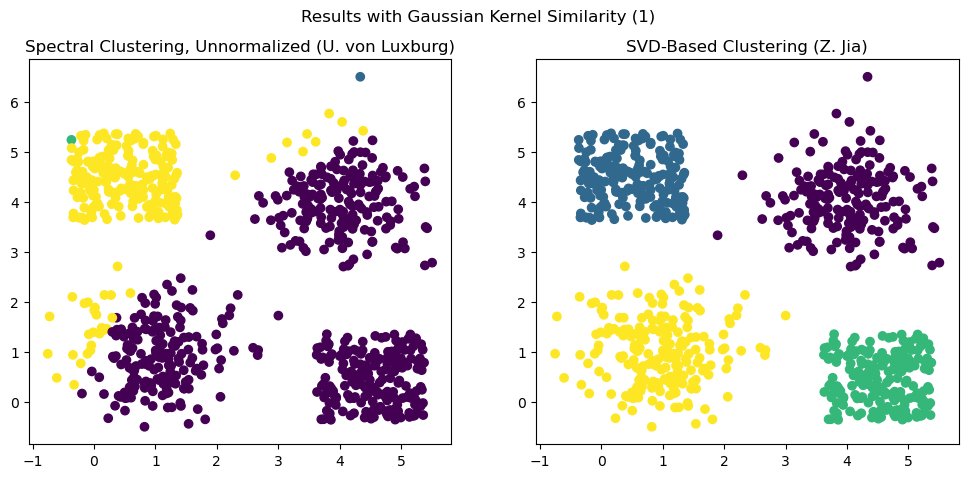
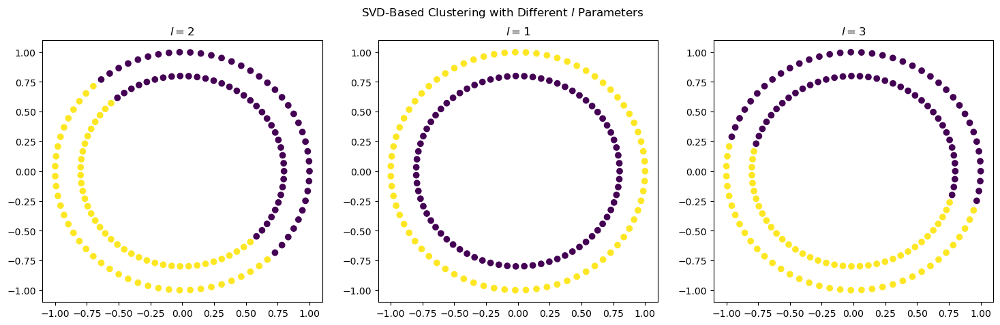
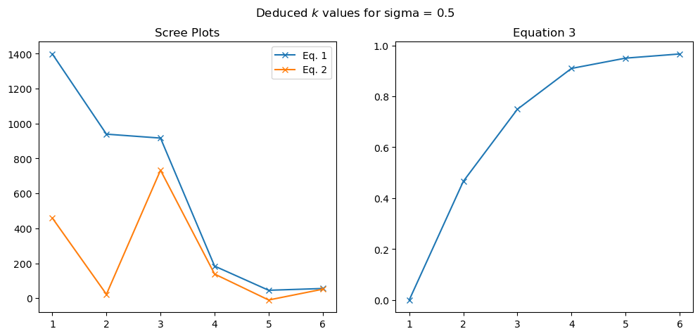
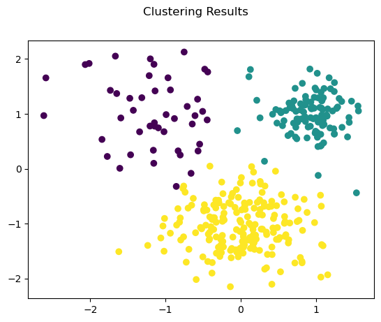

$\hrulefill$

# 1. Introduzione

In questo report studiamo due tecniche di clustering basate principalmente sulla diagonalizzazione delle matrici di somiglianza. L'algoritmo in questione è la cosiddetta *Spectral Clustering*.

In una delle tecniche si applicherà la fattorizzazione delle matrici più nota, vale a dire la *Singular Value Decomposition* (decomposizione ai valori singolari). 

Il risultato principale legato alla *SVD* è il teorema di Eckart-Young, che enuncia il seguente:

> *Teorema 1 (Eckart-Young).* Sia $A \in \mathbb R^{m \times n}$ una matrice reale e sia data una sua SVD $A = V\Sigma U^T = \sum_i \sigma_i V^{(i)} V^{(i), T}$. Definita $A_k$ la SVD troncata di $A$, si ha che $A_k$ è di rango $k$ e che vale la seguente equazione: $$\forall B \in \mathbb R^{m \times n}\text{ s.t. }\text{rank}(B)\leq k, \lVert A-A_k \rVert_2 \leq \lVert A-B\rVert_2  $$ ovvero $A_k$ è la miglior approssimazione di rango $k$ di $A$ in norma spettrale (2).

La *SVD* si ritrova quindi ad essere già applicata negli altri ambiti nell'analisi dei dati, tra cui la riduzione della dimensionalità (*PCA*), compressione delle immagini e la *Low-Rank Approximation*. Ci focalizziamo su come applicare questa tecnica nell'ambito del *Clustering*.

$\hrulefill$

# 2. Algoritmi di Clustering
Adesso descriveremo gli algoritmi di *Spectral Clustering*, partendo dalla sua formulazione originale. 

## 2.1. Spectral Clustering

Andremo a descrivere l'algoritmo *Spectral Clustering*. Le informazioni verranno principalmente tratte dal paper *"A Tutorial on Spectral Clustering"* (2007) di *Ulrike von Luxburg* [2].

**ALGORITMO.** (*Spectral Clustering Non Normalizzata*) 

Input: I dati $X \in \mathbb R^{m \times n}$ e il numero di cluster $k$ da formare

1. Costruire un grafo di somiglianza (*similarity graph*) $G = (V,E)$ a partire dai dati $X$
2. Calcolare la matrice laplaciana non normalizzata $L$ del grafo $G$
3. Calcolare i primi $k$ autovettori $u_1, \ldots, u_k$ di $L$
4. Sia $U \in \mathbb R^{n \times k}$ la matrice degli autovettori in colonna, ossia $U^{(i)} = u_i$
5. Considerare le righe della matrice $U$ e denominarle con la sequenza $(y_i)_{i = 1, \ldots, n}$
6. Effettuare il clustering sui punti $(y_i)_i$ con l'algoritmo *K-Means* e restituire i cluster formati

Osserviamo che il passo cruciale dell'algoritmo è il primo passaggio, ovvero la costruzione del grafo di somiglianza $G$, che viene rappresentata sotto forma di una matrice di adiacenze $A$.

Nel paper di riferimento vengono menzionati più metodi per costruire tale matrice. Il metodo di cui useremo più frequentemente consiste in creare un grafo connesso e pesato, dove gli archi vengono pesati da una funzione di somiglianza predefinita. Ad esempio, si userà il nucleo gaussiano $s(x, y):=\exp(-\lVert x-y \rVert^2 / (2\sigma)^2)$. 

In questo progetto abbiamo anche sperimentato ulteriori metodi per costruire il grafo di somiglianza; nel nostro caso abbiamo scelto di costruire il *KNN-graph*, ovvero un grafo dove i vertici $x_i$ e $x_j$ sono collegati se e solo se $x_j$ è uno dei primi $k$ vicini di $x_i$. Per garantire la simmetria di questo grafo, colleghiamo $x_i$ e $x_j$ se e solo se sono entrambi collegati (*mutual adjacency*).

Inoltre, è possibile trarre un'interpretazione geometrica dell'algoritmo appena descritto. Dato un grafo $G=(V,E)$, il *problema dei minimi $k$-tagli* (minimum $k$-cut) consiste in cercare un insieme minimo di archi per cui la loro rimozione comporta in una partizione di $k$ componenti connesse del grafo (fig. \ref{minkcuts}). Nel caso di presenza degli archi pesati, si cerca di minimizzare la somma dei pesi degli archi tagliati.

Si dimostra che un opportuno rilassamento del *problema dei minimi $k$-tagli* porta alla formulazione spettrale del problema, ossia all'algoritmo *Spectral Clustering* appena descritto; il rilassamento è un passaggio necessario, in quanto si dimostra che il problema originario è NP-hard.

{ width=40% }

## 2.2. SVD-Based Spectral Clustering

In una pubblicazione recente [1] è stato proposto una variante dell'algoritmo *Spectral Clustering*, in cui si applica la decomposizione ai valori singolari (*SVD*) nell'algoritmo. L'idea principale consiste in sostituire la diagonalizzazione della matrice laplaciana $L$ con la diagonalizzazione delle matrici $A^T A$ e $AA^T$; si richiama che $A$ denota la matrice delle adiacenze del grafo $G=(V,E)$. 

Dunque l'algoritmo sarà come segue.

**ALGORITMO.** (*Spectral Clustering Basata sulla SVD*)

Input: I dati $X \in \mathbb R^{m \times n}$, il numero di cluster $k$ da formare e il numero di vettori singolari sinistri da prendere in considerazione $l$

1. Costruire un grafo di somiglianza (*similarity graph*) $G = (V,E)$ a partire dai dati $X$ e rappresentarla mediante la matrice $A \in \mathbb R^{m \times m}$
2. Determinare una decomposizione ai valori singolari (SVD) di $A = U \Sigma V^T$
3. Scegliere i primi $l$ autovettori $u_1, \ldots, u_l$ di $U$
4. Sia $U' \in \mathbb R^{m \times l}$ la matrice degli autovettori in colonna, ossia $U'^{(i)} = u_i$
5. Considerare le righe della matrice $U'$ e denotarli con la sequenza $(y_i)_{i = 1, \ldots, n}$
6. Effettuare il clustering sui punti $(y_i)_i$ con l'algoritmo *K-Means* e restituire i cluster formati

Si osserva che è stato scelto di imporre la scelta del numero degli autovettori da considerare come un parametro. Nella pubblicazione [1] si istruisce di scegliere $l=k$ solitamente, e di eventualmente farlo variare in caso di creazione di cluster insoddisfacenti.

$\hrulefill$

# 3. Metodologia

In questa sezione svilupperemo tre esperimenti con dataset artificiali, per verificare le seguenti affermazioni sull'algoritmo *SVD-Based Clustering*:

1. L'autore sostiene che dalla scelta di diagonalizzare $AA^T$ invece della laplaciana $L$ si ottiene un processo di clustering più efficace
2. L'algoritmo *SVD-Based Clustering* è in grado di effettuare clustering sui dati di forma geometrica più complessa
3. Oltre a fornire un processo robusto di clustering, la decomposizione ai valori singolari (SVD) è usufruibile anche per dedurre i parametri $k$ e $\theta$, dove $\theta$ è un parametro eventuale del metodo della costruzione del grafo di somiglianza

L'implementazione degli algoritmi descritti nella *Sezione 2* sono stati implementati, per la maggior parte, con NumPy.

## 3.1. Dataset 1: Confronto tra Spectral Clustering con la sua variante SVD-Based

In questo esperimento si ha un dataset che contiene quattro cluster, di cui due sono di forma quadrata e gli altri due sono a forma di macchie casualmente generate (fig. \ref{data1}).

Per la costruzione del grafo di somiglianza, useremo il kernel gaussiano descritto nella *Sezione 2.1*. In particolare, imposteremo $\sigma = 1$ e $l=k=4$.

Il processo di clustering verranno effettuate sia dal *Spectral Clustering* che dalla sua variante *SVD-Based*; il fine di questo esperimento è di confrontare i loro risultati ed osservarli.

Inoltre, nello stesso esperimento abbiamo importato un altro dataset artificialmente generato dalla piattaforma *Kaggle* [3], contenente sette nuvole di dati con una forma diversa ognuna (fig. \ref{data1}).

In questo caso, si costruise il grafo di somiglianza mediante la costruzione del *KNN-graph*, come descritto nella *Sezione 2.1*. Si aggiunge che per la variante *SVD-based* non effettuiamo nessuna modifica al *KNN-graph* originario, siccome non è necessario garantire la simmetria di $A$ (poiché appunto si diagonalizza la matrice $A^T A$, che è una matrice simmetrica e definita semipositiva).

{width=70%}

## 3.2. Dataset 2: SVD-Based Spectral Clustering su dati non linearmente separabili

In questo esperimento si avranno due dataset con due cluster ciascuna, e saranno entrambi non linearmente separabili. Sono entrambi notevoli per la loro non separabilità lineare; da una parte di tratta di due cerchi concentrici, dall'altra parte delle due mezze lune (fig. \ref{data2}).

Per effettuare il clustering useremo solo la variante *SVD-Based* dello *Spectral Clustering*. 

Per il dataset dei due cerchi, useremo il kernel gaussiano descritto nella *Sezione 2.1.*; faremo variare il parametro $l$ per $l=1,2,3$. Invece per il dataset delle due mezze lune, andremo a costruire il grafo mediante il metodo dei $k$-*nearest neighbours* descritto precedentemente (vedere *Esperimento 1.* oppure *Sezione 2.1.*)

## 3.3. Dataset 3: Metodi di deduzione dai parametri tramite i valori singolari 

In questo esperimento tratteremo di un dataset artificialmente generato, contenente quattro cluster con numero di istanze diverse per cluster (fig. \ref{data3}) e con varianze diverse. Per effettuare il clustering, si usa la variante *SVD-Based* con parametri sconosciuti

L'obbiettivo di questo esperimento è quello di usare gli strumenti impiegati nella pubblicazione [1] per dedurre i parametri $k, \sigma$.

$k$: Per dedurre il parametro $k$, l'autore ha impiegato tre formule diverse:

$$
\sigma_k - \sigma_{k+1}
$$ {#eq:param1}

$$
\sigma_k - 2\sigma_{k+1} + \sigma_{k+2}
$$ {#eq:param2}

$$
\frac{\sum_{i \leq k} \sigma_i}{ \sum_{i \leq N} \sigma_i} \leq \theta
$$ {#eq:param3}
 
Per ottenere il parametro $k$ ottimo, si calcola il valore $k$ che massimizza i valori dati dalle formule [@eq:param1] e [@eq:param2]. In particolare, l'autore ritiene che la formula [@eq:param3] ritorna risultati più attendibili rispetto alla formula [@eq:param3]. Per quanto riguarda la formula [@eq:param3], si imposta un parametro $\theta \in (0,1)$ derivato a posteriori e poi di scegliere il minimo valore $k$ che soddisfi la disuguaglianza [@eq:param3]. 

$\sigma$ (o più generalmente $\theta$): Si tratta di confrontare i risultati ottenuti dalle equazioni [@eq:param1], [@eq:param2] e [@eq:param3]. Se sono tutti consistenti e allineati, allora si ritiene che il valore $\sigma$ scelto sia opportuno. Qualora si dovessero verificare delle inconsistenze (in particolare tra [@eq:param2] e [@eq:param3]), si ritiene di dover modificare il valore $\sigma$.

L'obbiettivo dell'esperimento si focalizzera dunque su impiegare le tecniche appena descritte, e vedere se siano opportune o meno, oppure se ci sono dei metodi alternativi per usare le formule [@eq:param1], [@eq:param2], [@eq:param3].

{width=50%}

$\hrulefill$

# 4. Risultati

## 4.1. Dataset 1
Si osserva che il *Spectral Clustering* non è riuscito a raggruppare i dati in una maniera soddisfacente, mentre la sua variante basata sulla *SVD* è riuscita a separare i gruppi nella maniera desiderata (fig. \ref{result1}).

Quindi si propone la *SVD-Based Spectral Clustering* come un'alternativa alla sua controparte originale, per poter dare risultati migliori di *clustering*. Tuttavia, è comunque possibile anche proporre altre varianti dello *Spectral Clustering*, tra cui:

* Usare un altro metodo per costruire il grafo di somiglianza, come ad esempio le KNN-Graph
* Invece di diagonalizzare la laplaciana $L$, usare la sua versione normalizzata $L_{\texttt{sym} } := I - D^{-1/2}A D^{-1/2}$.

Infatti, nella seconda parte dell'esperimento entrambi i metodi erano riusciti a riprodurre i cluster in una maniera soddisfacente - anche se la variante *SVD-based* era più accurata nel ricostruire i cluster (fig. \ref{result1knn}).

Tuttavia, osserviamo che per il *Spectral Clustering* originale era necessario impostare un valore del parametro $k$ alto, come ad esempio $k=60$, per poter proporre una ricostruzione soddisfacente; invece, per la variante *SVD-Based* era necessaria anche imporre solamente un valore del $k=15$. 

{width=70%}

{width=70%}

## 4.2. Dataset 2
Si evidenzia che impostando i parametri *standard*, l'algoritmo non è in grado di affrontare dei dati non linearmente separabili.

Tuttavia, si nota che facendo diminuire il parametro $l$ si riesce a raggruppare i due cerchi (fig. \ref{resultcircles}); invece impostandolo $l\geq k$ non si ottengono i cluster desiderati.

Per quanto riguarda invece il dataset delle due mezze lune, è stato necessario usare un metodo diverso per creare il grafo di somiglianza per poter creare dei buoni raggruppamenti. Inoltre notiamo che è anche necessario impostare il parametro $k$ correttamente, in quanto per $k=5$ non si crea i cluster desiderati ma si riesce per $k=15$ (fig. \ref{resultmoons}).

## 4.3. Dataset 3
Per $\sigma = 0.5$, non si riesce a ottenere un parametro $k$ definitivo. Disegnando i grafici delle equazioni [@eq:param1], [@eq:param2] e [@eq:param3] si ottiene che (fig. \ref{param1}):

* Per le formule [@eq:param1] si consiglia di impostare $k=2$, o $k=3$ se si usa il metodo del gomito
* Per la formula [@eq:param2] si consiglia di impostare $k=3$
* Tuttavia per la formula [@eq:param3] si sconsiglia di impostare $k=3$, siccome si avrebbe un valore minore di $\theta = 0.85$, che è la soglia consigliata [1].

Pertanto si considera $\sigma = 0.5$ un valore inattendibile per effettuare il clustering sui dati.

Invece per $\sigma = 1$, si ottiene che (fig. \ref{param2}):

* Per le formule [@eq:param1] e [@eq:param2] si consiglia di impostare $k=3$.
* La formula [@eq:param3] è d'accordo con tale risultato, siccome per $k=3$ si ha $0.863647$.

Pertanto si considera $\sigma=1$ un buon valore per eseguire l'algoritmo, con $k=3$. In effetti si derivano dei cluster soddisfacenti (\ref{result3}).

Inoltre, concludiamo che il metodo descritto dall'autore [1] è effettivamente in grado di fornire indizi sui parametri $k, \sigma$. In aggiunta, è possibile anche usare il metodo del gomito sulla formula [@eq:param1] per ottenere in una maniera più attendibile il parametro $k$.

{width=50%}

$\hrulefill$

# 5. Discussione e Considerazioni

Il *Spectral Clustering* è un algoritmo di clustering che si basa sulla teoria dei grafi. Tuttavia, nella sua formulazione originale in certi casi non è in grado di trattare adeguatamente i dati (fig. \ref{result1}); quindi si propongono varie varianti dell'algoritmo per sopperire a questo problema. 

Una delle varianti più recenti è la sua versione *SVD-Based* [1]: non solo è in grado di trattare anche dati non linearmente separabili (fig. \ref{resultcircles}), è anche in grado di dedurre i parametri del processo di *clustering*, basandosi solamente sullo studio della *SVD* della matrice del grafo $A \sim (V,E)$.

Tuttavia, i due algoritmi descritti in questo *report* condividono una debolezza: la complessità computazionale. Infatti lo *Spectral Clustering* è computazionalmente costoso in quanto deve costruire il grafo della somiglianza sui dati, che è solitamente in tempo $O(n^3)$. Ciò rende l'applicazione di questi metodi nei casi pratici abbastanza difficoltoso. 

Inoltre, l'algoritmo *SVD-Based Spectral Clustering* riporta delle sensibilità rispetto ai suoi parametri, in particolare alla scelta di $k$ e di $\sigma$. Quindi diventa cruciale effettuare delle scelte opportune per ogni dataset.

Nonostante ciò, concludiamo che l'algoritmo *SVD-Based Spectral Clustering* ha delle buone potenzialità per essere un algoritmo di *clustering*: essa infatti usa la *SVD*, uno degli strumenti matematici più rilevanti nell'analisi dei dati. Un possibile oggetto di ricerca futura è l'approfondimento di ulteriori algoritmi di *clustering* che si basano sulla decomposizione ai valori singolari (*SVD*). 

# 6. Riferimenti

[1] Z. Jia, «The reaserch on parameters of spectral clustering based on SVD», in Proceedings of 2013 3rd International Conference on Computer Science and Network Technology, Dalian, China: IEEE, ott. 2013, pp. 23–27. doi: 10.1109/ICCSNT.2013.6967056.

[2] U. von Luxburg, «A Tutorial on Spectral Clustering», 1 novembre 2007, arXiv: arXiv:0711.0189. doi: 10.48550/arXiv.0711.0189.

[3] [Clustering benchmark datasets, Kaggle](https://www.kaggle.com/datasets/vasopikof/clustering-benchmark-datasets)