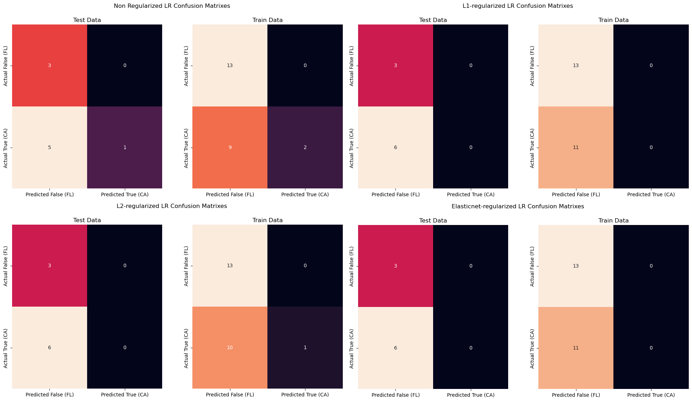
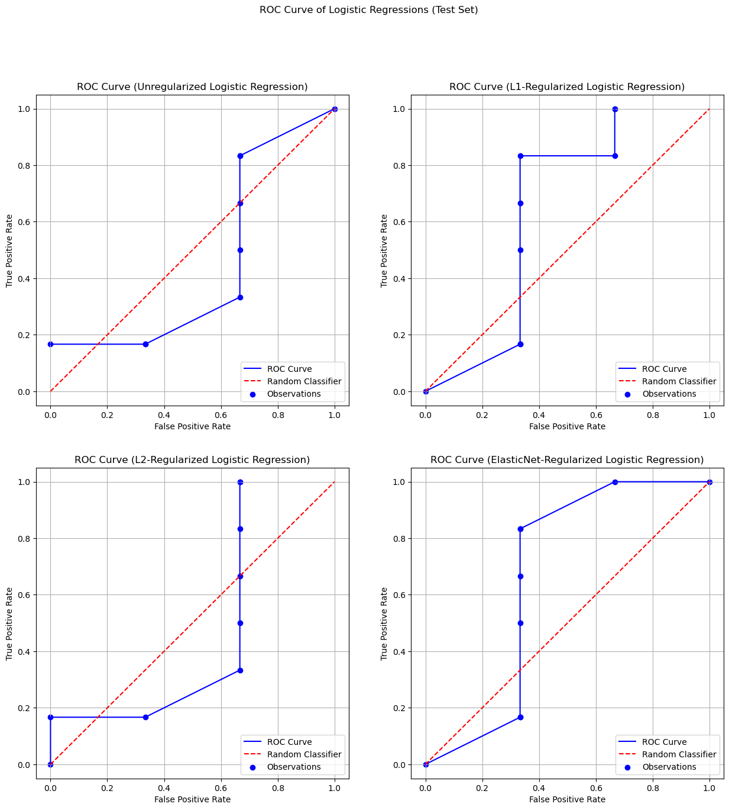
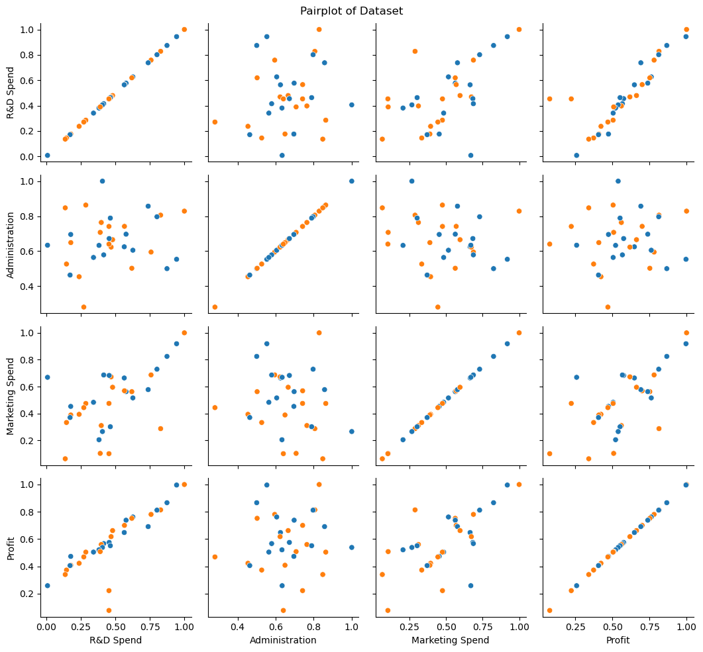

$\hrulefill$

# Introduzione
In questo report si descrive un resoconto di un progetto di Machine Learning, nel quale si prepara un dataset contenente informazioni su 50 start-up statunitensi - tra cui varie spese, lo stato e il profitto - e lo si analizza usando i metodi dell'apprendimento supervisionato. In particolare si va a usare i metodi della regressione logistica, usando delle eventuali regolarizzazioni per investigare sui suoi effetti.

> *Keywords: Machine Learning, Logistic Regression, Regularization, LASSO, Ridge, ElasticNet*

$\hrulefill$

# Metodologia
## Preparazione dei dati
La fase propedeutica - e la più cruciale - di questo progetto è la preparazione dei dati. Il dataset importato contiene sei variabili descrivente una startup, che sono:

* `R&D Spend`: Spese della startup su attivita *"Research & Development"*

* `Administration`: Costi di amministrazione della startup

* `Marketing Spend`: Costi di marketing della startup

* `State`: Lo stato in cui è basata la startup. 

* `Profit`: Il profitto ricavato dalla startup

Facendo un'ispezione preliminare del dataset, non ci sono dei problemi particolari come valori mancanti, variabili sparse e outlier. Pertanto non sarà necessaria effettuare la bonifica del dataset presente.

In questo progetto la variable `State` diventerà la nostra *"target variable"*, ossia la variabile che il modello imparerà a predirre.

Quindi nei prossimi passaggi vogliamo trasformare il dataset per presetare un *problema di classificazione binaria*. In particolare scegliamo `California` e `Florida` come le classi da predirre.

Per la trasformazione abbiamo usato la seguente *pipeline*:

* Filtrare le righe che contengano `State` uguale a `California` o `Florida`

* Effettuare la *one-hot encoding* su `State`, ossia `State` diventa una variabile binaria che contiene `1` se è California, `0` altrimenti (`Florida`)

* Normalizzare le variabili numeriche per riportarli sulla stessa scala; in particolare per ogni variabile dividiamo tutti i numeri per il massimo assoluto della colonna, così da avere una variabile numerica compresa nell'intervallo $[0,1]$

L'ultimo passaggio potrebbe rivelarsi cruciale per la fase della modellazione predittiva; infatti senza questa trasformazione il nostro modello potrebbe attribuire maggiore importanza alle variabili che presentano una scala più grande delle altre variabili.

$\hrulefill$

## Modellazione Predittiva
### Metodo di Valutazione
Nella fase di valutazione del modello, abbiamo adottato il metodo *hold-out*, suddividendo in una maniera semplice il dataset in due parti:

* **75% del dataset** per il training del modello, da cui si ottiene la *train F1-score*.

* **25% del dataset** per il testing, da cui si ricava la *test F1-score*.

Il metodo *hold-out* ci permette di valutare rapidamente le prestazioni del modello. La *test F1-score* è stata privilegiata come metrica principale in quanto essa fornisce una buona stima (sia in termini di precisione che di *recall*) delle prestazioni del modello su dati non visti, aiutando a identificare casi di *overfitting* o *underfitting*. In particolare, con l'implementazione di Scikit-Learn abbiamo scelto di calcolare la macro F1 score, assegnando il valore 1.0 nel caso di predizioni mancanti.

Per un'analisi più approfondita, sono stati utilizzati strumenti aggiuntivi:

* **Matrice di confusione**: per visualizzare la distribuzione delle previsioni del modello rispetto alle classi reali (veri positivi, falsi positivi, ecc.).

* **Curva ROC (Receiver Operating Characteristic)**: per valutare il bilanciamento tra il tasso di veri positivi (TPR) e il tasso di falsi positivi (FPR) al variare della soglia di classificazione.

Nel notebook è presente la funzione `assess_model(...)` che valuta automaticamente un modello - espresso in pesi - dando le F1-score, matrici di confusione entrambi sul dataset di training e di testing.

### Scelta dei Modelli Predittivi
Adesso si descrivono i modelli usati, e come sono stati implementati.

Prima di tutto abbiamo usato la regressione logistica implementata dalla libreria *Scikit-Learn*, ottimizzata con l'algoritmo L-BFGS.

Dopodiché abbiamo implementato manualmente la regressione logistica ottimizzata con l'algoritmo del Gradient Descent, nonché le sue regolarizzazioni. 

Per regolarizzare il nostro modello abbiamo usato tre metodi: la regolarizzazione LASSO (o nota come L1), la regolarizzazione RIDGE (o nota come L2) e la regolarizzazione Elasticnet.

La regolarizzazione LASSO consiste in aggiungere nella loss la somma dei pesi in valore assoluto, caratterizzata dal coefficiente di penalizzazione $\lambda\geq 0$.

Per tutti i modelli, si fissa una threshold del 0.5 per la predizione di un dato.

$$
\mathcal L_{\text{LASSO} } = \mathcal L + \lambda \sum_{n} |w_n|
$$

La regolarizzazione RIDGE è analoga alla regolarizzazione LASSO, solo che i pesi sommati sono elevati al quadrato.
$$
\mathcal L_{\text{RIDGE} } = \mathcal L + \lambda \sum_{n} |w_n|^2
$$

La regolarizzazione Elasticnet consiste nell'effettuare una media pesata tra la regolarizzazione RIDGE e LASSO, caratterizzata dal parametro di combinazione convessa $\gamma \in [0,1]$.
$$
\mathcal L_{\text{ELASTICNET} } = \mathcal L + \gamma (\lambda \sum_{n} |w_n|) + (1-\gamma)(\lambda \sum_{n} |w_n|^2)
$$

Nel nostro caso abbiamo scelto i parametri $\lambda = 0.05$, $\gamma = 0.5$.

$\hrulefill$

# Risultati
Riportiamo la performance di ogni modellom, quantificate con la *F1-score* sia sul dataset del *testing* che del *training*.

\centerline{\textit{Tabella 1}}

| Modello                                                    | Test F1-score* | Train F1-score* |
|------------------------------------------------------------|----------------|-----------------|
| Regressione Logistica (Sklearn o manualmente implementata) | 0.5253         | 0.4156          |
| Regressione Logistica (LASSO)                              | 0.3514         | 0.2500          |
| Regressione Logistica (RIDGE)                              | 0.4444         | 0.2500          |
| Regressione Logistica (ElasticNet)                         | 0.3514         | 0.2500          |

> \* *La test F1-score è arrotondata fino alla quarta cifra*

Si riporta inoltre le matrici di confusione di tutti i modelli manualmente implementati (fig. 1) in un'unica immagine

> 

Inoltre riportiamo la curva ROC delle regressioni logistiche regolarizzate (fig. 2)

> 

Alla fine, riportiamo anche i *scatterplot* (diagrammi di dispersione) delle variabili numeriche trasformate, per dare un panorama completo del nostro dataset (fig. 3).

> 

$\hrulefill$

# Discussione
Dalle F1-score dei modelli individuali (tabella 1), notiamo innanzitutto che con la regolarizzazione si ha un peggioramento dei risultati. Infatti, si verifica che tutti i modelli regolarizzati hanno una train score di 0.25, invece hanno una test score leggermente più alta.

Questo ci suggerisce un possibile caso di *underfitting* da parte dei modelli regolarizzati, infatti investigando le loro matrici di confusione notiamo che tendono a classificare gli esempi negativamente (fig. \ref{confusion_matrixes}). Al contrario, il modello non regolarizzato sembra di presentare una tendenza di *overfitting*, in quanto il punteggio di testing è leggermente più alto del punteggio di training (tabella 1).

Tuttavia, osservando le curve ROC prodotte da ogni modello (fig. \ref{roc_curves}) vediamo che i modelli regolarizzati sono più calibrati. In particolare otteniamo dei risultati buoni per i modelli regolarizzati in L1 o con ElasticNet, nonostante la loro scarsa performance in termini dell'F1-score.

$\hrulefill$

# Conclusione
In un progetto successivo si può mitigare le problematiche descritte nella discussione usando tecniche più raffinate per trasformare il dataset. 

Per esempio si potrebbe usare metodi non supervisionati per ridurre la dimensionalità del dataset (come PCA o T-SNE), trovare  trasformazioni opportune per il dataset che rende il problema linearmente separabile. Infatti, dal grafico delle dispersioni di tutte le variabili vediamo che le classi non sono separabili (fig. \ref{data})

Inoltre si potrebbe anche usare algoritmi di Machine Learning che sono in grado di imparare fenomeni più complessi (come reti neurali, modelli Ensemble, ...), sacrificando in cambio della semplicità e interpretabilità del modello. 

Poiché le confusioni di matrici ci suggeriscono che il metodo per separare i dati di allenamento e di testing erano squilibrati - poiché i modelli tendono a predirre le classi negativamente (fig. \ref{confusion_matrixes}) - si potrebbe suggere di usare dei metodi che forniscono delle stime più robuste sulle prestazioni del modello (ad esempio si potrebbe considerare il metodo della convalida incrociata stratificata).

