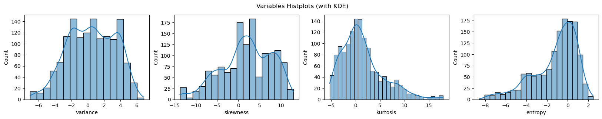
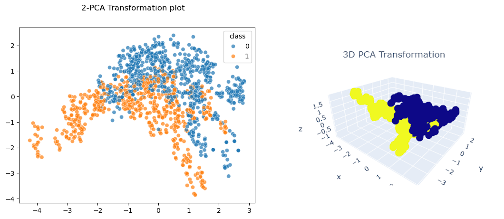
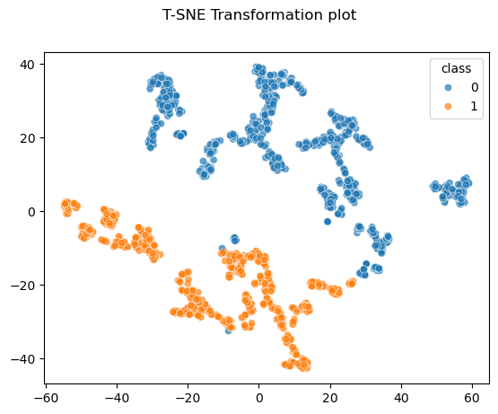
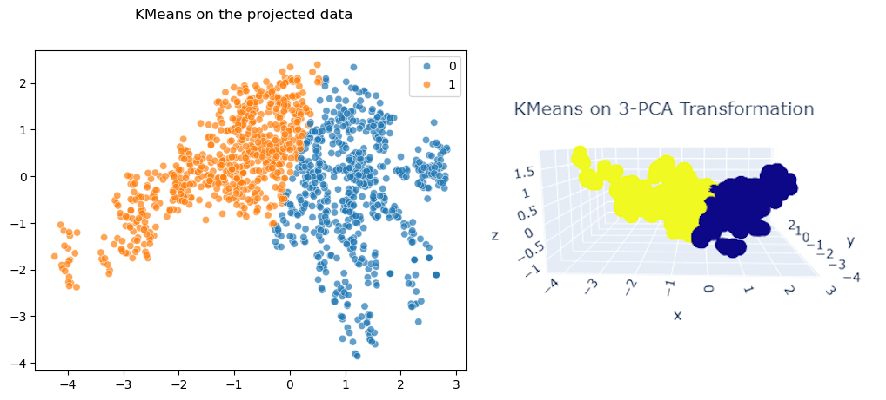
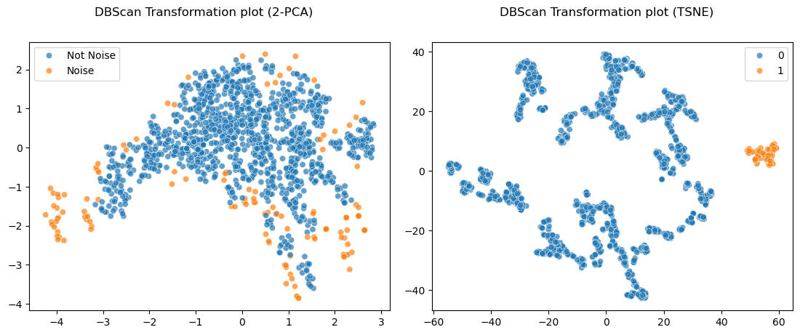
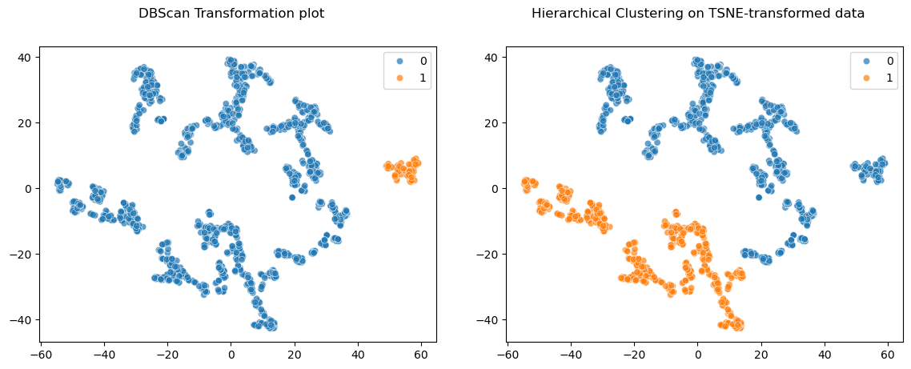
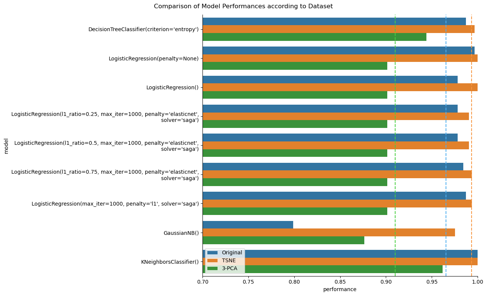

$\hrulefill$

# Introduzione
Il dataset è *"estratto da immagini scattate a esemplari simili a banconote, sia autentici che contraffatti. Per la digitalizzazione è stata utilizzata una telecamera industriale, solitamente impiegata per l’ispezione di stampe. Le immagini finali hanno una risoluzione di 400x400 pixel. A causa dell'obiettivo e della distanza dall'oggetto esaminato, sono state ottenute immagini in scala di grigi con una risoluzione di circa 660 dpi. Per l'estrazione delle caratteristiche dalle immagini è stato utilizzato uno strumento di Trasformata Wavelet"* [1]. Le variabili estratte dalle trasformate Wavelet sono le seguenti:

* Varianza (`variance`): variabile continua

* Asimmetria (`skewness`): variabile continue

* Curtosi (`kurtosis`): variabile continua

* Entropia (`entropy`): variabile continua

* Classe (`class`): variabile categorica, ha valore `0` oppure `1`

In questo report si riporteranno metodi per effettuare *clustering* e *modellazione predittiva* sul dataset estratto, per ottenere dei risultati significativi.

> *Keywords: Machine Learning, Clustering, Dimensionality Reduction, Predictive Models, Banknotes Classification*

[1] Lohweg, V. (2012). Banknote Authentication [Dataset]. UCI Machine Learning Repository. [(https://doi.org/10.24432/C55P57)](https://doi.org/10.24432/C55P57).

$\hrulefill$

# Metodologia
In questa sezione descriveremo le techniche usate nel progetto, nonché i nostri obbiettivi dell'analisi del dataset.

## Preparazione dei Dati
Una visualizzazione preliminari dei dati ci dice che non ci sono valori mancanti in nessuna variabile.

Tuttavia, visualizzando le variabili con gli istogrammi (fig. \ref{variables}), notiamo che variabili `kurtosis` ed `entropy` sono distribuite asimmetricamente. Inoltre, le variabili si trovano in scale diverse.

Come una misura precauzionale, standardizziamo tutte le variabili usando il c.d. *"Standard Scaling"*, ossia effettuiamo la normalizzazione con la media e la varianza di ogni variabile. In altre parole, usiamo la formula
$$
x^\ast = \frac{x-\mu}{\sigma}
$$

Dopodiché notiamo che tutti i dati sono ordinati per la loro classe; pertanto, si è deciso di mescolare casualmente i dati. In questo modo, se si dovesse effettuare un campionamento del dataset, si garantirebbe che questo campione non è sbilanciato nella classe target.

Infine, ai fini della modellazione predittiva, abbiamo diviso il dataset in due parti: test con dimensione 372, training con le istanze restanti. 

## Unsupervised Learning
Prima di affrontare il problema di classificazione binaria del dataset, indaghiamo il dataset più approfonditamente usando delle tecniche dell'*unsupervised learning*. 

Una prima fase è di applicare tecnihe di riduzione della dimensionalità del dataset per visualizzare i dati in due (o tre) dimensioni, e per verificare se con tali proiezioni (trasformazioni) il problema diventa linearmente separabile o meno. Dopodiché, sui dati proiettati useremo techniche del *clustering* per tentare di riprodurre fedelmente le classi originali.

Useremo la *Principal Components Analysis* per effettuare una prima riduzione della dimensionalità del dataset (sia a due che tre dimensioni), e poi useremo *K-means* e *DBScan* sul dataset trasformato col PCA.

Dopodiché vedremo anche delle techniche di embedding probabilistiche, in particolare la *T-SNE*, su cui useremo *DBSCAN* e clustering gerarchico (implementato da `AgglomerativeClustering` con Scikit-Learn).

## Supervised Learning
Nella fase finale del progetto si affronta il problema di classificazione binaria descritta dal dataset, ossia proveremo a creare dei modelli predittivi che siano in grado di predirre la variabile `class`, date le variabili `variance`, `skewness`, `kurtosis` ed `entropy`.

In particolare fitteremo più modelli e li valuteremo usando la *F1-score* calcolata sul *test dataset*. Elenchiamo i modelli usati (tutti implementati da Scitki-Learn):

* Alberi Decisionali ID3 (ovvero usando l'*entropia* come criterio di scelta delle variabili)

* Sei Regressioni Logistiche; una senza regolarizzazione, una regolarizzazione in L2, una regolarizzazione in L1, altre regolarizzate con ElasticNet (facendo variare il parametro di combinazione convessa $\gamma$)

* *Naïve Bayes* Gaussiano

* KNN (*K-Neighbours Classifier*)

Precisiamo che questa valutazione viene effettuata non solo sul *dataset* originale, useremo anche le variabili trasformate con PCA e T-SNE. Discuteremo gli effetti di questa scelta nei più dettagli nelle sezioni successive.

$\hrulefill$

# Risultati

Per quanto riguarda i risultati dell'*unsupervised learning*, riportiamo i grafici di dispersione dei dati trasformati con PCA e T-SNE (fig. \ref{PCA}, fig. \ref{TSNE}).

{ width=250px }

Inoltre, riportiamo anche i *cluster* prodotti dalle techniche di *clustering* usate (fig. \ref{KMeans_PCA}, fig. \ref{DBSCAN}, fig. \ref{clustering_TSNE}). 

Concentrandoci invece sulla fase del *supervised learning*, riportiamo il *barplot* delle *F1-scores* di ogni modello, valutato su tre dataset diversi (di cui uno originale), con le medie di tutti i modelli per dataset scelto (fig. \ref{models}).

\newpage

# Discussione
Commentiamo innanzitutto i risultati relativi all'*unsupervised learning*.

La *PCA* non è riuscita a trasformare il dataset originario in un problema che sia separabile, infatti le classi sono sovrapposte tra di loro, anche scegliendo di scegliere la proiezione in tre dimensioni (fig. \ref{PCA}). Infatti, usando la tecnica di clustering *K-Means* vediamo che questa fallisce a riprodurre le classi fedelmente, nonché a produrre dei *cluster* ben separati tra di loro (fig. \ref{KMeans_PCA}).

Per quanto riguarda invece la *T-SNE*, questa riesce invece a trasformare il dataset originario in un dataset linearmente separabile, infatti è possibile scandire una retta che divida le due classi (ad eccezione di alcuni punti separabili) (fig. \ref{TSNE}). Infatti, il *clustering* gerarchico è in grado di riprodurre quasi fedelmente le clasi orinarie (fig. \ref{clustering_TSNE}). 

Inoltre, *DBSCAN* è in grado di rilevare efficentemente dei punti *noisy* del dataset, tuttavia non è in grado di riprodurre le classi del dataset originale (fig. \ref{DBSCAN}).

Adesso passiamo al *supervised learning*. Commentiamo solo i risultati prodotti dal dataset originario, ovvero senza usare le trasformazioni *PCA* o *T-SNE*. 

Globalmente, i modelli sono stati in grado di predirre accuratamente la classe target, con una media complessiva del 0.9655 (tra tutti i modelli scelti e usati) (fig. \ref{models}). 

Osserviamo che *KNN* ha avuto la migliore prestazione, con una test F1-score del 1.0 (ovvero perfetta). 

Invece *Naïve Bayes* era il peggior modello, con un punteggio del 0.7987. Questo potrebbe essere dovuto al fatto che le variabili sono correlate tra di loro: infatti, con la PCA abbiamo visto che le classi non erano neanche separabili (fig. \ref{PCA}). Pertanto questa fa fallire l'ipotesi fondamentale del *Naïve Bayes*, ovvero l'indipendenza tra le variabili.

Infine osserviamo che la regressione logistica si presta migliore se non subisce nessun effetto di regolarizzazione; questo ci suggerisce che la regolarizzazione potrebbe portare all'*underfitting*, col dataset usato.

Siccome la prestazione dei modelli erano sufficentemente soddisfacenti, si è scelto di non effettuare la *hyperparameter tuning* (ottimizzazione degli iperparametri) sui modelli.

$\hrulefill$

# Conclusione
Il dataset che contiene informazioni sulle immagini delle banconote è complesso ed articolato, infatti i metodi *"lineari"* (come la PCA) falliscono di separare bene le classi dei dati, dove modelli più *"parametrici"* (come la *T-SNE* o la *KNN*) ottenevano risultati più soddisfacenti.

Un modo per migliorare i modelli predittivi è di includere la proiezione dei dati con *T-SNE* nella fase della preparazione dei dati: infatti effettuando nuovamente la valutazione dei modelli si ottiene globalmente un buon incremento, da una media globale del 0.7987 alla media globale 0.9934 (in particolare *Naïve Bayes* ha ottenuto un incremento drastico, dal 0.7987 al 0.9753).

Tuttavia, per giustificare in una maniera più rigorosa l'uso della *T-SNE* è necessario prendere ulteriori misure precauzionali; tra cui utilizzare la *T-SNE* usando parametri più diversi (in particolare con Scikit-Learn, il parametro più importante è`perplexity`) e poi di rivalutare i modelli. Questo ci assicurerebbe che i modelli non stiano *overfittando* sulle distorsioni prodotte dalla *T-SNE*, dunque validando effettivamente la robustezza della tecnica usata.

Un altro modo per garantirci la robustezza di questa tecnica è quella di includere metodi di valutazione dei modelli più robusti, come la convalida incrociata.
