$\hrulefill$

# Introduzione

\begin{center} \textit{ Keywords: Machine Learning, Kernel Methods, Ridge Regression, Principal Components Analysis, Support Vector Machines, Grid Search }  \end{center}

I *kernel methods* sono una famiglia di metodi e modelli noti del *Machine Learning* che, come suggeriti dal loro nome, vanno a sfruttare la cosiddetta *"kernel trick"* per effettuare una mappatura implicita di un *dataset* in uno spazio delle feature ad alta dimensionalità. 

L'obiettivo di questo report è quello di esplorare le potenzialità dei sopraccitati *kernel methods*, applicandoli a problemi di natura diversa e verificandone l’effettiva efficienza.

Useremo dei dataset generati artificialmente che vanno a rappresentare problemi di tipologie diverse, tra cui la regressione, riduzione della dimensionalità e la classificazione; su questi dataset generati sperimenteremo numerose tecniche del *Machine Learning*, sia *unsupervised* che *supervised*. Tra queste tecniche useremo la *Ridge Regression*, la *PCA* e le *SVM*. Naturalmente, useremo sia la versione *"lineare"* che la loro *"controparte"* *kernel*.

Infine confronteremo i risultati per trarre delle conclusioni sugli effetti dei metodi *kernel* in ambito dell'analisi dei dati e del *Machine Learning*.

$\hrulefill$

# Metodologia
In questa sezione si descrivono i passaggi svolti per questo progetto. 

Si dichiara che, in termini implementativi dei modelli di Machine Learning, il progetto è stato interamente svolto con *Scikit-Learn* [1].

[1] [Documentazione di Scikit-Learn](https://scikit-learn.org/)

## Dataset 1: Funzione Non Lineare
Nel primo problema si genera un dataset a due variabili, di cui una è esplanatoria (i.e. indipendente) e l'altra è la variabile target. Denoteremo queste variabili rispettivamente con $x, y$.

In particolare, definiremo $y=f(x)$ sull'intervallo $x \in [-5,5]$. La funzione da imparare generata è la seguente funzione non-lineare:

$$
f(x)=(x+4)(x+1)(\cos x -1)(x-3)+\varepsilon_x
$$ {#eq:nonlinear}

Dove $\varepsilon_x$ è il *noise*, generato casualmente seguendo la distribuzione normale $\varepsilon_x \sim \mathcal N(0,1)$. Un *plot* rappresentativo di questa funzione è fornita in figura \ref{function}.

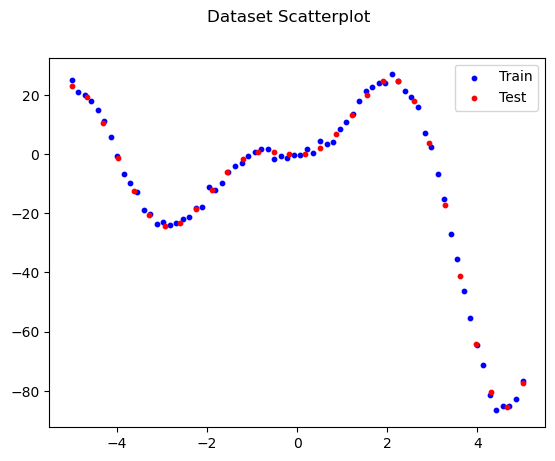{ width=45% }

In totale abbiamo generato 100 punti per il dataset. Abbiamo diviso il dataset in due parti, quello di *training* e quello di *testing*; per la divisione dei dati abbiamo seguito la proporzione 70-30.

Per valutare i modelli, useremo la metrica dell'errore medio quadratico (*MSE*) e il punteggio *R2* sul dataset del *testing*.

Come primo approccio abbiamo addestrato e valutato una *ridge regression* non kernelizzata, fornendoci una specie di *baseline* per i modelli successivi.

Dopodiché abbiamo iniziato a sperimentare con varie *ridge regression* kernelizzate, facendo variare i suoi iperparametri: in particolare abbiamo usato il kernel gaussiano (*RBF*) e polinomiale.

Per trovare la migliore combinazione dei iperparametri, abbiamo effettuato due *Grid Search* sul dataset di allenamento. Per i modelli kernel abbiamo definito il seguente spazio degli iperparametri

| Kernel      | Parametro | Spazio                    |
|-------------|-----------|---------------------------|
| Gaussiano   | ``gamma``     | $10^{-5}, \ldots, 10^{5}$ |
| Polinomiale | ``degree``    | $2,3,\ldots,7,8$          |
|             | ``alpha``     | $10^0, \ldots, 10^4$      |

: Hyperparameters for GridSearchCV {#tbl:hyperparams1}

Infine, per scegliere il miglior modello, abbiamo valutato il migliore modello gaussiano e polinomiale sul dataset di testing.

\newpage

## Dataset 2: Due Circonferenze
Nel problema successivo si affronta uno dei problemi di classificazioni più noti e quasi tipica per i metodi kernel: il dataset a due dimensioni e a due classi, disposte su due cerchi concentrici (fig. \ref{circles}). 

Prima di tutto, abbiamo applicato l'analisi delle componenti principali (*PCA*) sul dataset e proiettando la trasformazione sia in due che una dimensione. Dopodiché, abbiamo *fittato* una macchina a supporto vettoriale soft-margin (*SVM*) non kernelizzato sul dataset del training, e l'abbiamo valutato per fornire una *baseline* per i modelli successivi.

Per valutare i modelli, abbiamo calcolato la F1-score su entrambi i *split* del dataset.

Dopodiché abbiamo applicato la *PCA* kernelizzata usando il kernel gaussiano col parametro $\gamma = 3$, e per verificare il ben-funzionamento del kernel scelto abbiamo addestrato e valutato una *SVM* kernelizzata col kernel selezionato. 

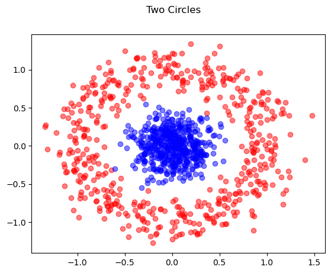{ width=35% }

\newpage

## Dataset 3: Classificazione
Per l'ultimo problema abbiamo generato un dataset con la funzione `make_classification()` di Scikit-Learn (modulo `datasets`), che va a generare un problema di classificazione a due classi con 20 variabili.

Abbiamo dunque trasformato il dataset con la *PCA* e abbiamo preso la sua proiezione in due e tre dimensioni per dare una semplice visualizzazione dei dati. Dopodiché, abbiamo allenato e valutato una *SVM* sul dataset, per ottenere delle *performance baseline*.

Per valutare i modelli, abbiamo calcolato la F1-score su entrambi i *split* del dataset.

Dopodichè abbiamo allenato e valutato più *SVM kernel* sul dataset, fornendo come parametri quelli forniti di *default* da Scikit-Learn.

Per determinare quale fosse la miglior scelta del kernel con la migliore combinazione di iperparametri, abbiamo deciso di effettuare una ricerca casuale (*randomized search*) valutata mediante la convalida incrociata. La scelta di una ricerca casuale rispetto ad una *Grid Search* è motivata dal fatto che stiamo effettuando una ricerca su un dominio di iperparametri piuttosto ampio, infatti tre parametri ricevono numeri continui. Precisamente, effettueremo 5000 ricerche casuali.

In particolare, abbiamo definito il dominio degli iperparametri della ricerca casuale con le seguenti variabili aleatorie (o liste, nel caso discreto):

| Iperparametro | Tipo       | Dominio\*                             |
|---------------|------------|---------------------------------------|
| `C`           | continuo   | $\mathcal U(-5 \log(10), 5 \log(10))$ |
| `kernel`      | categorico | poly, rbf, linear, sigmoid            |
| `gamma`       | continuo   | $\mathcal U(-5 \log(10), 5 \log(10))$ |
| `degree`      | intero     | 2,3,4,5,6,7,8                         |
| `coef0`       | continuo   | $\mathcal U(-10, 10)$                 |

: Hyperparameters for RandomSearchCV {#tbl:hyperparams2}

> \* $\mathcal U (a,b)$ denota la distribuzione uniforme nell'intervallo $[a,b]$.

$\hrulefill$

# Risultati
## Dataset 1: Funzione Non Lineare
Riportiamo le prestazioni di tutti i modelli addestrati e valutati (sul test dataset), in formato tabulare:

|         **Kernel**         | **Valutazione** | **Punteggio** |
|:--------------------------:|:---------------:|:-------------:|
| Gaussiano (RBF)            | R2              | 0.9810        |
|                            | MSE             | 17.7460       |
| Polinomiale                | R2              | 0.8771        |
|                            | MSE             | 114.7043      |
| Lineare (Ridge Regression) | R2              | 0.2263        |
|                            | MSE             | 772.0261      |

: Models Performances on Dataset 1 {#tbl:performances1}

Plottiamo inoltre le predizioni del miglior modello, fornendoci un'idea grafica (fig. \ref{best_model_dataset1})

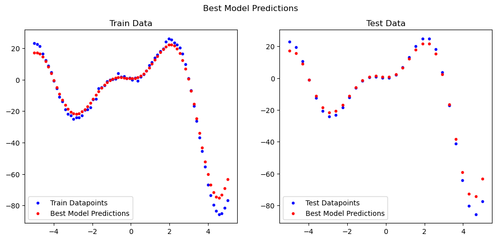{ width=75% }

Aggiuntivamente plottiamo le predizioni della *ridge regression* non-kernel (fig. \ref{linear_fit})

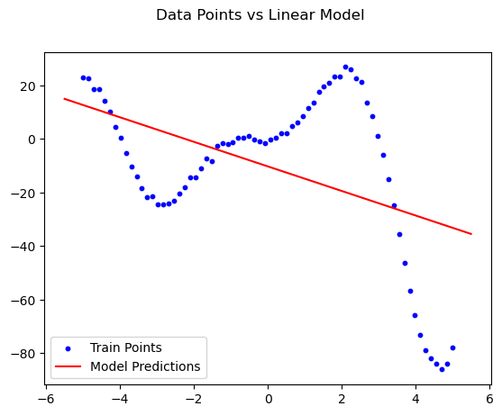{ width=40% }

Infine, riportiamo i grafici delle predizioni dei modelli kernel con la variazione dei loro iperparametri (fig. \ref{variations1}, \ref{variations2}). Precisiamo che per la variazione del kernel polinomiale (fig. \ref{variations2}), la variazione dell'iperparametro `alpha` viene fatta variare col grado del polinomio: la variazione di `alpha` viene rappresentato da sfumature diverse del rosso.

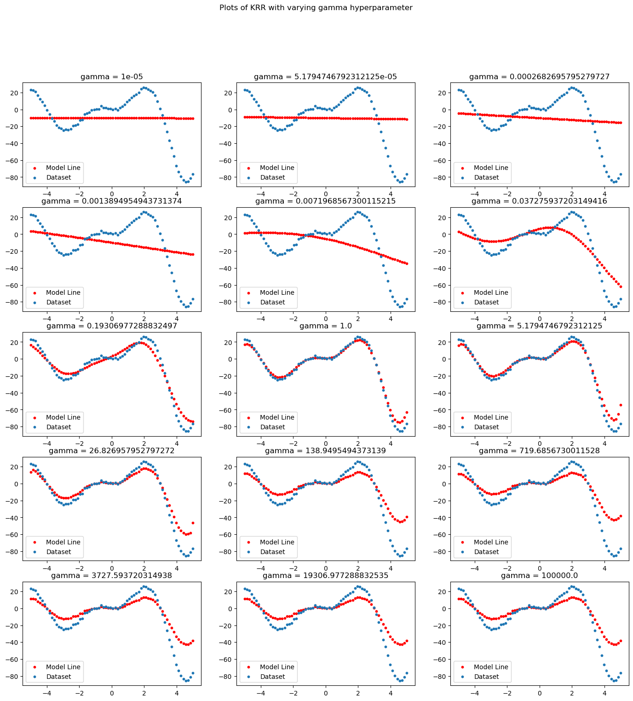

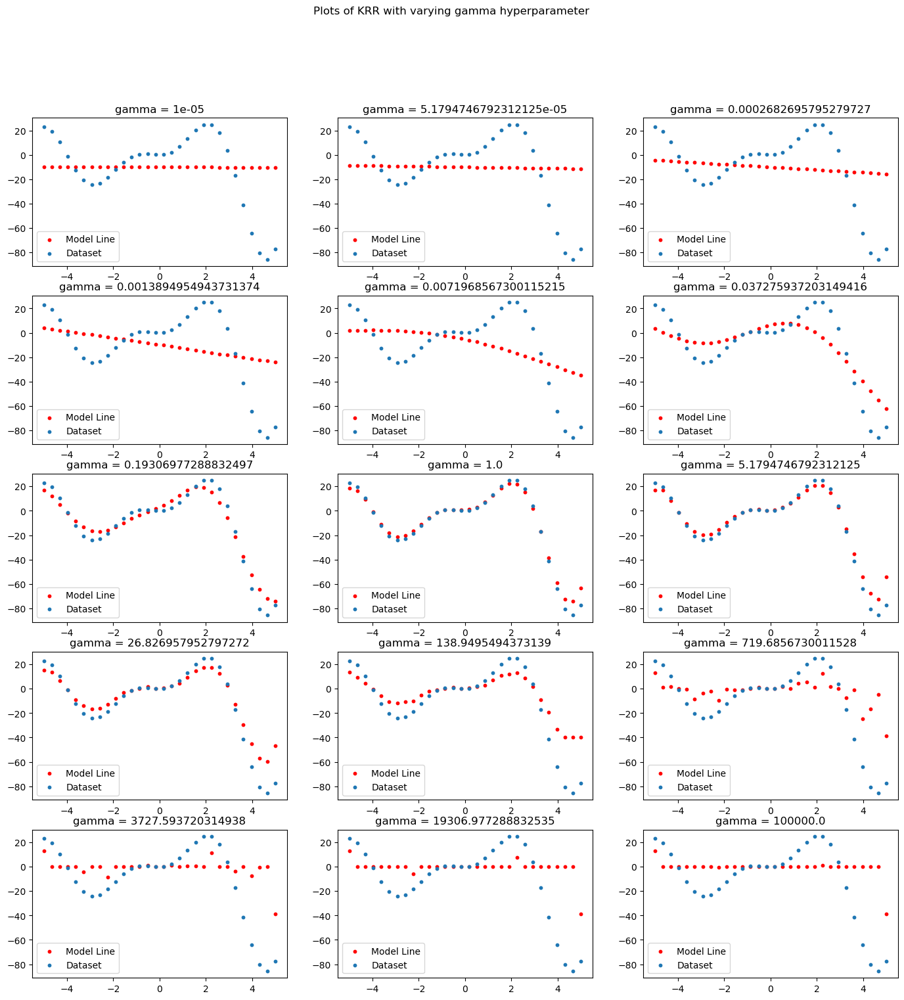

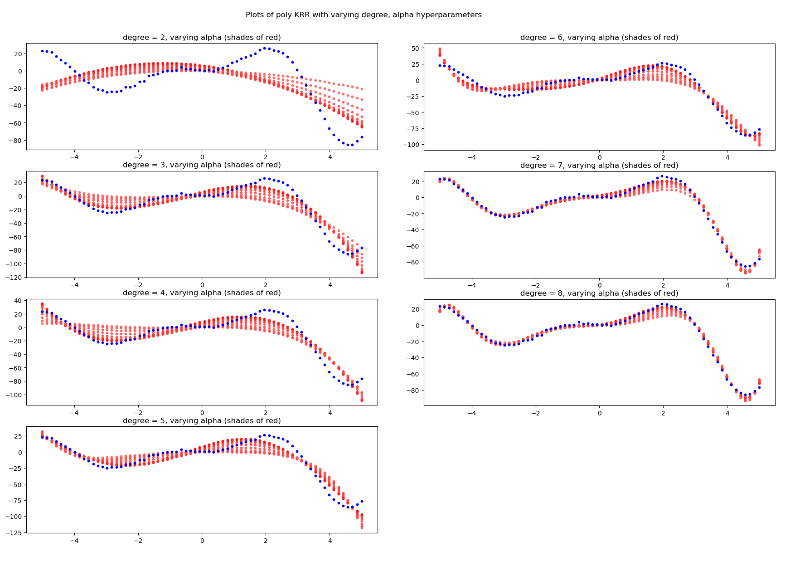

\newpage

## Dataset 2: Due Circonferenze
Riportiamo innanzitutto le rappresentazioni grafiche delle trasformazioni fornite dalla PCA, una di cui non-kernel e l'altra kernelizzata (fig. \ref{PCA_dataset2}, \ref{KPCA_dataset2}).

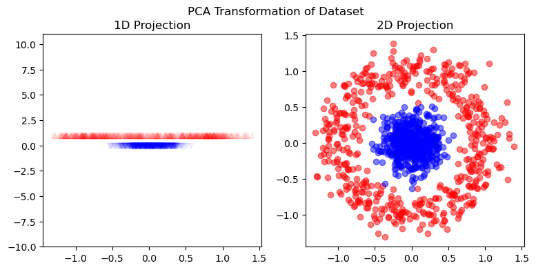{ width=60%}

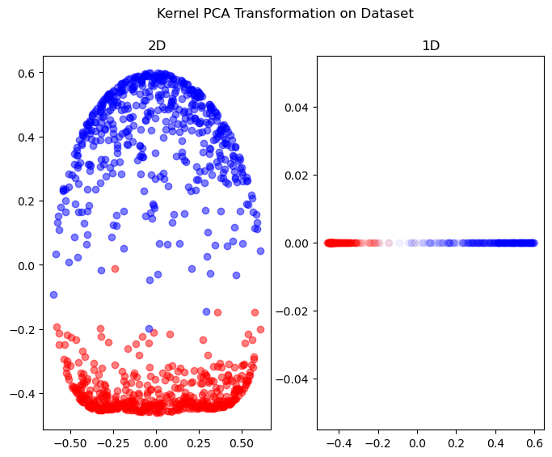{ width=60% }

Infine, i punteggi F1 (macro media) dei modelli SVM sono le seguenti:

|   **Modello**  | **Train** | **Test** |
|:--------------:|:---------:|:--------:|
| SVM non kernel | 0.65      | 0.59     |
| SVM kernel     | 1.00      | 0.99     |

: Models Performances on Dataset 2 {#tbl:performances2}

\newpage

## Dataset 3: Classificazione
Si plotta innanzitutto le proiezioni in due e tre dimensioni della PCA sul dataset (fig. \ref{PCA_3_3D})

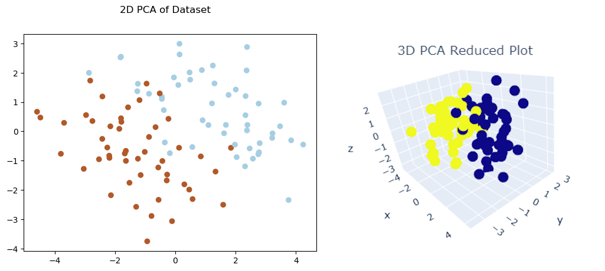{ width=60% }

Dopodiché riportiamo dalle varie trasformate fatte dalla kernel PCA. Le proiezioni in due e tre dimensioni sono riportate in figure separate (fig. \ref{KPCA_3_2D}, \ref{KPCA_3_3D})

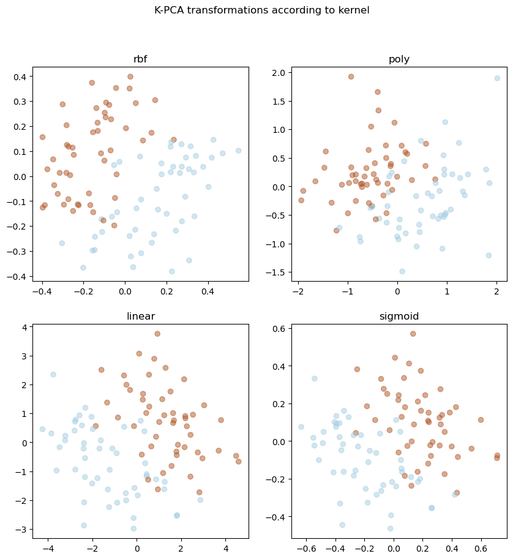{ width=60% }

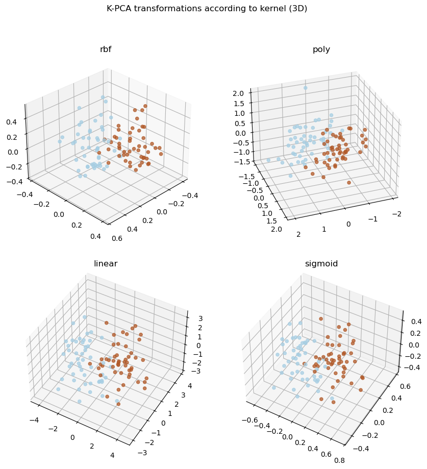{ width=60% }

Adesso riportiamo le performance dei modelli addestrati sul dataset, usando la F1 score (macro media).

|       **Modello**      | **Train** | **Test** |
|:----------------------:|:---------:|:--------:|
| SVM non kernel         | 1.00      | 0.96     |
| SVM kernel gaussiano   | 1.00      | 0.92     |
| SVM kernel polinomiale | 1.00      | 0.96     |
| SVM kernel lineare     | 1.00      | 0.96     |
| SVM kernel sigmoide    | 0.97      | 0.92     |
| SVM Random Search      | 1.00      | 0.96     |

: Models Performances on Dataset 3 {#tbl:performances3}

Infine, enunciamo che il miglior modello trovato dalla ricerca casuale è il **kernel PCA col kernel lineare**. Imperocchè il kernel è lineare, gli altri iperparametri sono irrilevanti e dunque omessi. 

$\hrulefill$

# Discussione
## Dataset 1: Funzione Non Lineare
Osservando le performance dei modelli, è evidente che la kernelizzazione è un fattore necessario per affrontare il problema. 

Infatti, il modello non-kernel (ossia la Ridge Regression) riporta un punteggio R2 basso (0.2263, [@tbl:performances1]) e dalla rappresentazione grafica del dataset (fig. \ref{function}) si evince che il modello non è sufficientemente complesso per spiegare la non-linearità della funzione target (fig. \ref{linear_fit}, [@eq:nonlinear]).

Prima di concludere il commento sui punteggi dei modelli, osserviamo come variano le predizioni dei modelli a seconda dei valori degli iperparametri scelti. 

Per quanto riguarda il kernel gaussiano (*RBF*), abbiamo fatto variare il parametro $\gamma$ che corrisponde all'ampiezza reciproca del kernel gaussiano [1]. Ovvero, $\gamma = \frac{1}{\sigma^2}$. Osserviamo che per valori piccoli di $\gamma \to 0$, la kernel regression crea le predizioni con una curva più liscia (fig. \ref{variations1}). Al contrario, per valori più grandi la curva si adatta di più alla funzione target ([@eq:nonlinear]). Per valori grandi $\gamma \to +\infty$, otteniamo invece una forma più *"compatta"* (i.e. i punti stimati sono molto vicini tra di loro) della funzione imparata; tuttavia osservando il comportamento del modello sul dataset del testing, otteniamo una linea dritta con dei *"picchi"* sugli estremi (fig. \ref{variations1_test}).

Da ciò deduciamo che valori estremi di $\gamma$ corrispondono a casi di *underfitting* e *overfitting*. Per il valore di circa $\gamma = 1.0$, otteniamo una *fit* ideale sul problema.

Passando ora al kernel polinomiale, abbiamo sperimentato gradi diversi del polinomio e il valore di regolarizzazione reciproca $\alpha = \frac{1}{2C}$ [2]. Chiaramente si evince che aumentando il grado, otteniamo una regressione con più curve e che dunque si adatta meglio al problema (fig. \ref{variations2}). Inoltre, il parametro di regolarizzazione $\alpha$ determina la liscezza della funzione imparata, dove un numero più alto causa una curva più liscia.

Infine, concludiamo che il kernel che si adatta meglio al problema è il kernel gaussiano, con una R2 score del 0.9810 ([@tbl:performances1]). Questa potrebbe essere dovuta alla natura periodica della funzione da imparare ([@eq:nonlinear]), per cui delle curve gaussiane sono in grado di adattarsi meglio alla forma funzionale fornita.

[1] [Documentazione di Scikit-Learn sul Kernel Gaussiano](https://scikit-learn.org/stable/modules/metrics.html#rbf-kernel)

[2] [Documentazione di Scikit-Learn sul Kernel Ridge Regression](https://scikit-learn.org/stable/modules/generated/sklearn.kernel_ridge.KernelRidge.html)

## Dataset 2: Due Circonferenze
Come nel dataset precedente, l'utilizzo dei metodi non kernel - in questo caso la *PCA* e la *SVM* - non è sufficiente per affrontare il problema di classificazione. 

Guardando i grafici delle riduzioni in una e due dimensioni effettuata dalla *PCA*, vediamo che le due nuvole di dati rimangono comunque linearmente inseparabili. In una dimensione le classi si sovrappongono, e in due dimensioni il dataset rimane perlopiù uguale (fig. \ref{PCA_dataset2}). Osserviamo che il fatto che la proiezione in 2D rimane più o meno uguale è dovuto al fatto che la *PCA* tenta di trovare una rotazione per spiegare la separazione delle classi al meglio; tuttavia, data la forma del dataset, con una qualsiasi rotazione lineare, la forma geometrica dei dati rimane uguale.

Il fatto che la *SVM* non kernel ha una scarsa performance, circa del 0.6 e 0.5 sui dati di training e testing ([@tbl:performances2]) - e quindi abbiamo delle stime quasi casuali - conferma le nostre deduzioni effettuate dalla *PCA*.

Usando invece una *PCA kernel*, otteniamo delle classi linearmente separabili sia in una che due dimensioni (fig. \ref{KPCA_dataset2}), pertanto si ritiene che questo kernel è ideale per questo problema. Il fatto che usando la *kernel SVM* con gli stessi parametri, otteniamo un modello che *fitta* quasi perfettamente il problema con punteggio 1.00 e 0.99 ([@tbl:performances2]) conferma la buona scelta del kernel.

Il fatto che il modello non fitti perfettamente al problema è dovuto ad un aspetto intrinseco del dataset, ovvero la presenza dei punti rumorosi.

## Dataset 3: Classificazione
Anticipiamo che, al contrario dei problemi precedentemente affrontati, la kernelizzazione potrebbe risultare non solo innecessaria, ma anche dannosa, portando in alcuni casi a peggiorare i risultati.

Notiamo innanzittutto che l'ultimo dataset è più complesso, essendo composto da venti variabili e non solo una o due come nei dataset precedenti. Pertanto è impossibile visualizzare i dati nella sua forma intera.

Dunque come punto di partenza abbiamo effettuato una riduzione della dimensionalità con la *PCA non kernel*, effettuando la proiezione in due e tre dimensioni. Notiamo che il problema ridotto in due e tre dimensioni diventa quasi linearmente separabile, ovvero le due nuvole di dati possono essere separate da un iperpiano separatore (fig. \ref{PCA_3_3D}).

Il fatto che la *SVM non kernel* ci ritorna perlopiù un buon risultato (con train 1.00 e test 0.96, [@tbl:performances3]) ci conferma questa osservazione (i.e. la separabilità lineare del dataset).

Effettuando più *kernel PCA*, otteniamo dei dataset che sono più o meno ugualmente linearmente separabili (fig. \ref{KPCA_3_2D}, \ref{KPCA_3_3D}). Si potrebbe pertanto pensare che la *kernelizzazione* dei metodi non fa variare i risultati in una maniera drastica.

Osservando che le *performance* dei *SVM kernel* sono al meglio uguali a quella della *SVM non kernel* ([@tbl:performances3]), possiamo confermare questa deduzione. Tuttavia notiamo che in certi casi la *test score* peggiora ([@tbl:performances3]) a 0.92: questo ci suggerisce un possibile *overfit* da parte dei modelli kernelizzati, peggiorando dunque le prestazioni sul dataset di valutazione.

L'elemento cruciale che emerge dalle 5000 ricerce casuali sullo spazio degli iperparametri ([@tbl:hyperparams2]), è il fatto che otteniamo comunque una *SVM* col *kernel lineare*, che è di fatto una *SVM non kernel*. Questo ci suggerisce che nonostante un'esplorazione estensiva degli iperparametri per i metodi kernel, questi vengono sempre superati dal metodo lineare (*non kernel*).

$\hrulefill$

# Conclusione
I metodi *kernel* sono degli ottimi e indispensabili strumenti per affrontare problemi che presentano delle forme geometriche intrinsecamente complesse, come funzioni non-lineari ([@eq:nonlinear]) o nuvole di dati non linearmente separabili (fig. \ref{circles}).

Ciò non vuol dire i metodi *kernel* sono privi di difetti e possono essere sempre applicati senza problemi. A parte il possibile elevato costo computazionale con dei dataset particolarmente larghi, che non è il caso di questo studio in quanto abbiamo preso dati con un numero di esempi abbastanza piccoli (al massimo 1000), c'è anche la possibilità che i modelli *overfittino* e abbiano peggiori prestazioni. Come verificato nel terzo problema, questo potrebbe accadere in presenza di più variabili.

Inoltre, un altro problema riscontrato con i problemi *kernel* è l'alta sensibilità agli iperparametri. Come notato nella seconda parte, i modelli cambiano forma (e dunque le loro prestazioni) in una maniera drastica a variare degli parametri scelti (fig. \ref{variations1}, \ref{variations2}). Pertanto, di norma potrebbe essere necessaria avere delle conoscenze sul dataset - soppratutto la loro disposizione geometrica - oppure bisogna fare delle ricerche estensive sullo spazio degli iperparametri, usando ad esempio GridSearch.

In definitiva, pur tenendo queste criticità i metodi *kernel* restano comunque degli ottimi strumenti per risolvere problemi complessi, purché siano usati con attenzione e consapevolezza.

