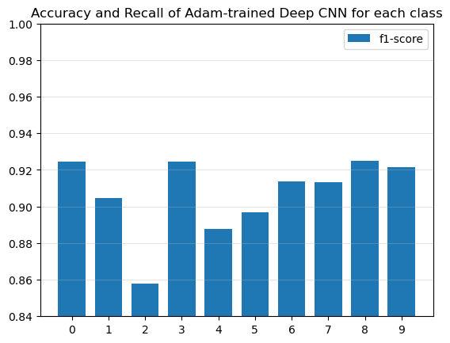

$\hrulefill$

# Introduzione

*Kuzushiji-MNIST* è una variazione del dataset noto *MNIST*, solo che al posto di contenere numeri si concentra sui caratteri *Kuzushiji* (corsivo giapponese) [1]. 

L'obbiettivo di questo report è quello di sperimentare le tecniche del deep learning (i.e. reti neurali) per creare un modello che sia in grado di riconoscere i caratteri *Kuzushiji* con una buona precisione. 

In particolare, andremo a modellare sia *Feed-Forward Neural Networks* (FFNN), che *Convolutional Neural Networks* (CNN) ed aggiustare i suoi iperparametri (come il numero dei layer, l'ottimizzatore da usare, numero dei parametri, eccetera...) per ottenere il modello più efficace e capire come la scelta dell'architettura vada ad influire sull'efficienza delle predizioni sul dataset scelto.

[1] [Deep Learning for Classical Japanese Literature, Tarin Clanuwat, Mikel Bober-Irizar, Asanobu Kitamoto, Alex Lamb, Kazuaki Yamamoto, David Ha, 2018](https://arxiv.org/abs/1812.01718)

$\hrulefill$

# Metodologia

In questa sezione descriveremo la *pipeline* usata nell'esperimento. Si dichiara che, in termini implementativi, il progetto è stato svolto con i pacchetti *PyTorch* (per i modelli) e *Scikit-Learn* (per alcune metriche di valutazioni).

## Preprarazione del Dataset
Abbiamo importato il dataset per l'addestramento e la valutazione del modello separatemente, li chiameremo rispettivamente *train* e *test* dataset. 

Dopodiché, abbiamo ulteriormente diviso i dati d'addestramento in due parti: una per l'addestramento effettivo dei modelli, l'altra per ottenere una valutazione di metrica. Questi verranno chiamati rispettivamente *train* e *validation* dataset. La divisione segue la proporzione 70-30, 70% riservata al *train* set e 30% riservata al *validation* set.

Inoltre, vale menzionare che il dataset è stato casualmente rimescolato (con la seed posta a `42`, per garantire la replicabilità dell'esperimento) per garantirci che le classi siano effettivamente distribuite casualmente.

Inoltre, abbiamo visualizzato le prime 12 immagini del dataset, per ottenere un'idea del dataset (fig. \ref{dataset}).

## Architettura delle Neural Networks
Per quanto riguarda l'architettura delle *Neural Networks* (i.e. reti neurali), abbiamo definito 4 modelli, seguendo quest'ordine:

1. **Shallow FFNN**: Per darci una *baseline* (i.e. un punteggio *"base"* per tutti i modelli che creeremo), abbiamo creato e addestrato una *Shallow Neural Network*, contenente un solo hidden layer con 512 parametri (*"neuroni"*).

2. **Deep-FFNN**: Poiché, proseguendo sulla linea dei *Feed-Forward Neural Networks*, abbiamo creato una *Deep Neural Network*, contenente tre strati nascosti (contenenti rispettivamente, 1024, 2048, 512 parametri).

3. **Shallow-CNN**: Spostandoci sulla traccia delle *Convolutional Neural Networks*, abbiamo creato una *Shallow Convolutional Network*, ossia una rete neurale contenente un layer di convoluzione con kernel $3 \times 3$, un numero variabile di canali (tra 8, 16 e 32) in output ed una scelta variabile di *pooling*, tra cui il *max-pooling*, *min-pooling*, *average-pooling* e *adaptive average-pooling*. Questo modello sarà utile per fornirci una *"baseline"* per la *"Deep Convolutinal Neural Network"*, di cui parleremo prossimamente.

4. **Deep-CNN**: Infine, abbiamo deciso di creare una *Deep Convolutional Neural Network*, composto da:

* Un layer convoluzionale, con dimensione del nucleo $3 \times 3$ e padding di un pixel, creando 16 canali

* Al layer convoluzione è applicato il maxpooling con dimensione del nucleo $2 \times 2$ e con stride $2 \times 2$

* Un altro layer convoluzionale, con dimensione del nucleo $5 \times 5$, creando 32 canali

* Come prima, applichiamo il maxpooling, con dimesione del nucleo $2 \times 2$

* Un layer di appiattimento da $5 \times 5 \times 32$ a $800$

* Un layer lineare che manda $\mathbb R^{800}\longrightarrow \mathbb R^{10}$, dandoci l'output \*

>> \* Notiamo che non è stata applicata esplicitamente la *softmax* all'output finale, in quanto la libreria di Pytorch prevede già l'applicazione della *softmax* nel calcolo della loss (Cross Entropy).

4. Le motivazioni della scelta di questa struttura sono dati dalle valutazioni dei modelli precedenti (baseline). Per una motivazione argomentata, vedere la sezione [discussione](#discussione).

Le architetture delle reti neurali sono concettualmente raffigurate in figura \ref{shallow_models}, \ref{deep_models}.

\newpage

## Training delle Neural Networks
Adesso parliamo della *pipeline* con cui abbiamo fatto addestrare le nostre reti neurali.

Cominciamo con le caratteristiche comuni: tutti i modelli hanno la loss valutata con la *Cross-Entropy*, ideale per un problema di classificazione.

Da ogni epoca (i.e. iterazione dell'addestramento del modello sul dataset intero) abbiamo ricavato le seguenti metriche di valutazione: la train loss, la test loss, la train accuracy e la test accuracy. Tuttavia anticipiamo che per dare una valutazione più robusta precisa dei nostri modelli, useremo le matrici di confusione.

Per quanto riguarda la funzione di attivazione $\sigma$, abbiamo scelto per tutti i modelli di usare la funzione *ReLu* come l'attivazione.

Dopodiché, avevamo due scelte per l'ottimizzatore: la *Stochastic Gradient Descent* o *Adam*. Per darci un'idea di quale scegliere, abbiamo allenato il modello baseline sulle entrambe, e abbiamo valutato entrambi i metodi con la *train* e *test* loss.

Inoltre, per lo stesso modello ci siamo posti il problema dell'inizializzazione dei parametri. Per fornirci una baseline completamente replicabile abbiamo inizializzato il modello baseline con tutti parametri zeri; solo dopo abbiamo allenato lo stesso modello con i parametri inizializzati casualmente, per fornirci un'altra baseline.

Infine, abbiamo anche scelto di sperimentare dei metodi di *scheduling* per gestire la *learning rate* $\eta$. Per Adam abbiamo usato uno scheduler *"a step"*, con parametri `step_size=10` e `gamma=0.5`. In parole più semplici, ogni 10 epoche dimezziamo la learning rate attuale. La learning rate iniziale è $\eta = 0.01$\*. Questo potrebbe rivelarsi cruciale per garantirci la convergenza del modello alla soluzione ottimale.

Per tutti i modelli *"baseline"*, ossia i modelli shallow, abbiamo allenato i modelli fino a 50 epoche. Per quanto riguarda i modelli più complessi, ovvero quelli *"deep"*, abbiamo troncato il numero delle epoche a 25 per mitigare rischi di overfitting (per una motivazione completa vedere la discussione dei risultati). Al fine di mantenere l'efficienza dello scheduler, abbiamo ridotto parametro `step_schedule` da 10 a 5, aumentando a sua volta `gamma` da 0.5 a 0.75.

> \* Per questioni di convergenza determinati a posteriori, per la *deep fully-connected neural network* abbiamo posto la learning rate a $\eta=0.005$.

## Valutazione dei Modelli
Per comparare le prestazioni di ogni modello, abbiamo utilizzato la loro *train* e *test* loss in fase di valutazione. 

Come anticipato nella sezione precedente, per dare una valutazione più robusta sui singoli modelli abbiamo creato delle *confusion matrixes* sulle predizioni del modello; in questo modo, andiamo oltre la *micro accuracy* (i.e. la precisione data dalla proporzione delle classificazioni corrette) calcolata durante la fase di addestramento dei modelli.

Definiamo $C$ la matrice di confusione relativa ad un modello valutato su un dataset (training, validation o testing). L'entrata $C[i, j]$ è data dalla quantità delle classi $i$ classificate dal modello come $j$.

Pertanto, dalla matrice $C$ siamo in grado di ricavare la precisione, la *recall* e la *f1-score* relativa ad ognuna classe. Dopodiché, facendo le medie di queste metriche su ogni classe otteniamo la macro precisione, *macro recall* e *macro f1-score*.

$\hrulefill$

# Risultati

Riportiamo i punteggi dei modelli *baseline* con la seguente tabella ([@tbl:baseline_performances]):

|                 **Modello**                | **Train** | **Validation** | **Test** |
|:------------------------------------------:|:---------:|:--------------:|:--------:|
| SGD Shallow FFNN, 0-init.                  |  0.933801 |       0.859806 | 0.859806 |
| ADAM Shallow FFNN, 0-init.                 |  0.998956 |       0.925084 | 0.844416 |
| SGD Shallow FFNN, random-init.             |  0.993588 |       0.951748 | 0.887012 |
| ADAM Shallow FFNN, random-init.            |  1.000000 |       0.958032 | 0.898613 |
| Shallow CNN, low channels (8)              |  0.999152 |       0.936001 | 0.866423 |
| Shallow CNN, medium channels (16), maxpool |  1.000000 |       0.957886 | 0.900096 |
| Shallow CNN, high channels (32)            |  1.000000 |       0.958268 | 0.907507 |
| Shallow CNN, minpool                       |  0.999977 |       0.929172 | 0.855312 |
| Shallow CNN, avgpool                       |  1.000000 |       0.955191 | 0.902635 |
| Shallow CNN, adaptive avgpool              |  1.000000 |       0.957153 | 0.901174 |

: Baseline Models Performances {#tbl:baseline_performances}

Adesso riportiamo i grafici delle loss dei modelli baseline, ricavati dalla fase dell'allenamento (fig. \ref{optimizer_results}, \ref{channels_results}, \ref{pooling_results}).

Infine, riportiamo i risultati dei modelli finali; ovvero sia i modelli shallow *"rappresentativi"* che i modelli *deep*. Le loss sono riportate in fig. \ref{general_results} e le prestazioni in [@tbl:final_performances]

|  **Modello** | **Train** | **Validation** | **Test** |
|:------------:|:---------:|:--------------:|:--------:|
| Shallow CNN  |  1.000000 |       0.957886 | 0.900096 |
| Deep CNN     |  0.996232 |       0.963932 | 0.908054 |
| Shallow FFNN |  1.000000 |       0.958032 | 0.898613 |
| Deep FFNN    |  0.994109 |       0.947209 | 0.874761 |

: Final Models Performances {#tbl:final_performances}

Adesso concentriamoci su un modello particolare: la *rete neurale convoluzionale deep*. Prima di tutto plottiamo la sua *train* e *testing* loss assieme (fig. \ref{cnn_loss}).

{ width=50% }

Dopodiché, mostriamo anche la matrice di confusione valutata su tutti i *split* del dataset (train, validation e testing) (fig. \ref{cnn_cm})

Inoltre, abbiamo ritenuto interessante plottare l'istogramma dei punteggi *recall, precision, f1* divisi per classe (fig. \ref{cnn_accrecall}, \ref{cnn_f1})

{ width=50% }

{ width=50% }

\newpage

$\hrulefill$

# Discussione {#discussione}

## Modelli Baseline

Cominciamo dalla discussione dei modelli *baseline*, da cui deriva la giustificazione sia della scelta di certi iperparametri per la fase di allenamento, che della scelta dell'architettura della *Deep CNN*.

Notiamo innanzitutto che generalmente tutti i modelli baseline sono già in grado di modellare *"bene"* il dataset del training, con un punteggio di accuracy di almeno 0.975 ([@tbl:baseline_performances]). Tuttavia, hanno una difficoltà nel generalizzare bene i problema, subendo dei cali drastici nelle performance sul dataset di validazione e soppratutto sul dataset del testing. Questo ci suggerisce che i modelli FFNN stanno *overfittando* sul dataset del training.

Inoltre, con l'ottimizzatore *Adam* la convergenza al minimo della *training loss* è quasi garantita, avendo la loss $< 0.0001$. Al contrario, con la *Stochastic Gradient Descent* sembra di raggiungere un *minimo locale* (fig. \ref{optimizer_results}). Tuttavia, valutando la *testing loss*, appare che l'ottimizzatore *Adam* ha testing loss più alta, e sembra addirittura di crescere.

Tuttavia, guardando la tabella delle prestazioni ([@tbl:baseline_performances]), la differenza della *validation* e *testing* accuracy valutata tra i due ottimizzatori è abbastanza bassa, con una differenza massima di circa $\sim 0.01$.

Pertanto, abbiamo scelto di usare l'ottimizzatore *Adam* per tutti gli altri modelli, in quanto sembra essere garantita e più veloce la convergenza della loss a 0.

Prima di passare ai modelli baseline della *Convolutional Neural Network*, facciamo un breve commento sulla scelta dell'inizializzazione dei pesi. Notiamo che chiaramente i risultati dipendono dall'inizializzazione scelta: infatti, sia la loss che i punteggi dei modelli allenati con pesi inizializzati a 0 sono più bassi di quelli allenati con i pesi casualmente inizializzati. 

Adesso vediamo le *Shallow CNNs*, che forniranno un'idea della scelta degli iperparametri della *Deep CNN*. Tra gli iperparametri che abbiamo fatto variare sono il numero dei canali del layer convoluzionale, e dalla tipologia del pooling scelto.

Vediamo il numero canali in output; un numero alto di canali tende a migliorare i risultati ([@tbl:baseline_performances]); in particolare, notiamo che un numero basso dei canali stranamente determina un *overfitting* maggiore del modello. Infatti, la testing loss del modello con soli 8 canali sembra essere la più alta (fig. \ref{channels_results}). Questo potrebbe essere spiegato dal fatto che dando più canali, diamo maggior capacità al modello di apprendere dei schemi più profondi nel dataset.

Pertanto, per il modello finale sceglieremo di immettere un numero medio di canali e poi di aumentare man mano i canali. Nel caso nostro, siamo partiti da 16 canali per incrementarlo a 32.

Adesso vediamo il tipo di operatore *pooling* utilizzato. Chiaramente la *min-pooling* causa un peggioramento delle prestazioni ([@tbl:baseline_performances], fig. \ref{pooling_results}). Invece la *average-pooling*, la *adaptive average-pooling* e la *max-pooling* sembrano di dare risultati simili, seguendo grafici delle loss simili e ritornando punteggi simili.

Pertanto, sceglieremo il *max-pooling* in quanto essa sembra di avere la miglior capacità di generalizzazione, con una validation score del 0.957886 ([@tbl:baseline_performances]).

## Risultati Generali

Passiamo ai risultati relativi ai modelli finali. Possiamo commentare prima di tutto che un numero maggiore di *layer* causa un maggiore *overfittng* sulle *Feed-Forward Neural Networks*.

Questo era aspettato, in quanto queste reti neurali sono sotto rischio di *overfitting* con una maggiore dimensione dell'input e di parametri da imparare. Infatti, il modello *deep* richiede all'incirca $\simeq 4 \times 10^6$ parametri.

Al contrario, la *Convolutional Neural Network* è diventata leggermente più robusta ai dati di testing; questo è invece dovuto al fatto che queste architetture hanno decisamente meno parametri da imparare e che sono in grado di imparare le relazioni locali, presenti nelle immagini (fig. \ref{dataset}). Inoltre, implementando sistemi di *pooling* abbiamo introdotto un grado di invarianza nel modello, rendendolo ancora più robusto.

Concludiamo dichiarando che il miglior modello era la *Deep Convolutional Neural Network*, con una test score del 0.908054. 

## Studio Approfondito della Deep CNN

Adesso analizziamo specificamente il miglior modello, interrogandoci particolarmente sulle metriche di valutazione usate. Fino ad ora abbiamo usato solamente la *macro-average precision* e la *loss* come metriche di riferimento.

Iniziamo costruendo la matrice di confusione del modello valutato su tutti i pezzi del dataset (fig. \ref{cnn_cm}). Notiamo che da queste matrici possiamo ricavare anche i punteggi *recall*, *f1-score* separati per classi. 

Quindi osservando i punteggi *precision* e *recall* calcolati sul *testing dataset*, notiamo che generalmente queste due metriche sono pressoché vicini (fig. \ref{cnn_accrecall}). Tuttavia, abbiamo due casi anomali: le classi 4, 5 presentano una differenza drastica tra la *precision* e il *recall* (rispettivamente di circa $\sim 0.6$, $\sim 1.0$). Ovvero, il nostro modello è più in grado di predirre queste classi correttamente di quanto è in grado di comprendere queste classi.

Da questo momento, potrebbe sorgere il dubbio che la *precision* non sia più una metrica sufficiente a descrivere le prestazioni di un modello. Effettivamente, la *precision* da sola potrebbe fornire una buona idea generale delle prestazioni, ma non è sufficiente per avere una visione approfondita delle prestazioni del modello. 

Per avere una metrica che vada a comprendere entrambi tutti i casi, è meglio usare la metrica *f1-score* che va a comprendere sia la *recall* che la *precision*. Infatti, osserviamo che le anomalie del caso precedentemente sono *"risolte"* con la *f1-score*, dove il punteggio di queste classi sono abbassate (fig. \ref{cnn_f1}).

$\hrulefill$

# Conclusione

Concludiamo che, sebbene abbiamo ottenuto dei modelli piuttosto soddisfacenti, rimane in sospeso la questione dell'*overfitting*. Infatti, tutti i modelli sono in *overfitting*, solo che il miglior modello subisce un *"grado"* minore di overfitting. 

Per migliorare i risultati ottenuti in questo esperimento, si suggerisce di sperimentare ulteriori teniche per mitigare l'overfitting.

Ad esempio, la regolarizzazione con *"dropout"* per i layer lineari e con *"dropblock"* per i layer convoluzionali potrebbe mitigare l'overfitting dei modelli.

Inoltre, osservando i grafici delle test loss dei modelli, in molti casi vediamo che ad una certa *"epoch"* in poi la test loss inizia ad *"esplodere"*, tende a crescere invece di decrescere (fig. \ref{channels_results}, \ref{pooling_results}); si potrebbe implementare un algoritmo sofisticato che vada a controllare le *loss* e in base all'andamento della *loss* determinare se effettuare un arresto anticipato dell'allenamento.

Oppure, un modo per assicurare che i modelli siano in grado di apprendere meglio gli schemi del dataset è quello di aggiungere ulteriori layer, ed eventualmente considerare la scelta di usare dei blocchi residui. Tuttavia, con questo approccio si rischia di *"peggiorare"* l'*overfitting* dei modelli.

Uno stratagemma ancora più radicale è quello del cosiddetto *"data augmentation"*, ovvero intervenire sul *training dataset* creando repliche di immagini con delle permutazioni casuali. 

Integrando queste strategie, si potrà definire un modello robusto e *"buono"*.